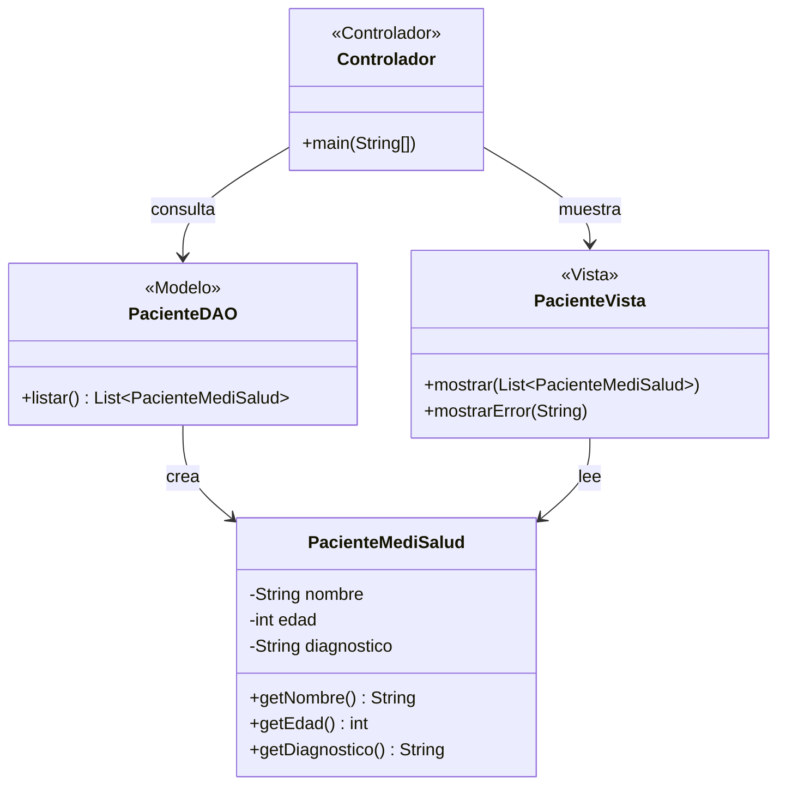

# 💡 Ejemplo 06 — Arquitectura MVC

## 🌍 Contexto

MediSalud ya sabe conectarse a MySQL, ejecutar consultas y usar `PreparedStatement`, pero todo su
programa de reportes de pacientes vive en una sola clase: la conexión JDBC, la consulta, y el formato de
impresión están todos mezclados en el mismo método.

**Qué busca demostrar este ejemplo**: cómo aplicar la arquitectura Modelo-Vista-Controlador a un proyecto
Java, separando el acceso a datos, la presentación y la coordinación entre ambos, sin cambiar el
resultado observable del programa.

## 🏥 Caso de estudio

MediSalud reorganiza su programa de reportes de pacientes en tres capas: Modelo (datos y acceso JDBC),
Vista (presentación por consola) y Controlador (coordinación).

## 🗺️ Diagrama



## 🌳 Árbol de archivos — antes

```text
mvc-antes/
└── com/medisalud/
    └── Demo.java
```

## 💻 Archivo: Demo.java

```java
package com.medisalud;

import java.sql.Connection;
import java.sql.DriverManager;
import java.sql.ResultSet;
import java.sql.SQLException;
import java.sql.Statement;

public class Demo {
    private static final String URL = "jdbc:mysql://localhost:3306/medisalud";
    private static final String USUARIO = "root";
    private static final String CLAVE = "curso_java_root";

    public static void main(String[] args) {
        try (Connection conexion = DriverManager.getConnection(URL, USUARIO, CLAVE);
             Statement sentencia = conexion.createStatement();
             ResultSet resultado = sentencia.executeQuery(
                     "SELECT nombre, edad, diagnostico FROM pacientes ORDER BY id")) {
            System.out.println("=== Pacientes de MediSalud ===");
            while (resultado.next()) {
                System.out.println(resultado.getString("nombre") + " (" + resultado.getInt("edad")
                        + " anios) - " + resultado.getString("diagnostico"));
            }
        } catch (SQLException e) {
            System.out.println("Error real de base de datos: " + e.getMessage());
        }
    }
}
```

## ✅ Resultado esperado — antes

```text
=== Pacientes de MediSalud ===
Ana Torres (34 anios) - Gripe
Luis Rios (45 anios) - Hipertension
Marta Diaz (29 anios) - Migrana
```

## 🌳 Árbol de archivos — después

```text
mvc-despues/
└── com/medisalud/
    ├── modelo/
    │   ├── PacienteMediSalud.java   (nuevo)
    │   └── PacienteDAO.java         (nuevo)
    ├── vista/
    │   └── PacienteVista.java       (nuevo)
    └── controlador/
        └── Controlador.java         (nuevo)
```

## 💻 Archivo: PacienteMediSalud.java

```java
package com.medisalud.modelo;

public class PacienteMediSalud {
    private final String nombre;
    private final int edad;
    private final String diagnostico;

    public PacienteMediSalud(String nombre, int edad, String diagnostico) {
        this.nombre = nombre;
        this.edad = edad;
        this.diagnostico = diagnostico;
    }

    public String getNombre() {
        return nombre;
    }

    public int getEdad() {
        return edad;
    }

    public String getDiagnostico() {
        return diagnostico;
    }
}
```

## 💻 Archivo: PacienteDAO.java

```java
package com.medisalud.modelo;

import java.sql.Connection;
import java.sql.DriverManager;
import java.sql.ResultSet;
import java.sql.SQLException;
import java.sql.Statement;
import java.util.ArrayList;
import java.util.List;

public class PacienteDAO {
    private static final String URL = "jdbc:mysql://localhost:3306/medisalud";
    private static final String USUARIO = "root";
    private static final String CLAVE = "curso_java_root";

    public List<PacienteMediSalud> listar() throws SQLException {
        List<PacienteMediSalud> pacientes = new ArrayList<>();
        try (Connection conexion = DriverManager.getConnection(URL, USUARIO, CLAVE);
             Statement sentencia = conexion.createStatement();
             ResultSet resultado = sentencia.executeQuery(
                     "SELECT nombre, edad, diagnostico FROM pacientes ORDER BY id")) {
            while (resultado.next()) {
                pacientes.add(new PacienteMediSalud(resultado.getString("nombre"), resultado.getInt("edad"),
                        resultado.getString("diagnostico")));
            }
        }
        return pacientes;
    }
}
```

## 💻 Archivo: PacienteVista.java

```java
package com.medisalud.vista;

import com.medisalud.modelo.PacienteMediSalud;
import java.util.List;

public class PacienteVista {

    public void mostrar(List<PacienteMediSalud> pacientes) {
        System.out.println("=== Pacientes de MediSalud ===");
        for (PacienteMediSalud paciente : pacientes) {
            System.out.println(paciente.getNombre() + " (" + paciente.getEdad()
                    + " anios) - " + paciente.getDiagnostico());
        }
    }

    public void mostrarError(String mensaje) {
        System.out.println("Error real de base de datos: " + mensaje);
    }
}
```

## 💻 Archivo: Controlador.java

```java
package com.medisalud.controlador;

import com.medisalud.modelo.PacienteDAO;
import com.medisalud.vista.PacienteVista;
import java.sql.SQLException;

public class Controlador {
    public static void main(String[] args) {
        PacienteDAO modelo = new PacienteDAO();
        PacienteVista vista = new PacienteVista();

        try {
            vista.mostrar(modelo.listar());
        } catch (SQLException e) {
            vista.mostrarError(e.getMessage());
        }
    }
}
```

## ✅ Resultado esperado — después

```text
=== Pacientes de MediSalud ===
Ana Torres (34 anios) - Gripe
Luis Rios (45 anios) - Hipertension
Marta Diaz (29 anios) - Migrana
```

## 🔍 Comparación: la prueba concreta

Ambas versiones producen exactamente la misma salida, verificable ejecutando las dos: la reorganización
no cambia el comportamiento observable del programa, solo su estructura interna. En la versión "antes",
una sola clase abre la conexión, ejecuta la consulta y formatea la salida — cambiar cómo se presentan los
datos obligaría a tocar el mismo método que accede a la base. En la versión "después", `PacienteDAO`
(Modelo) solo sabe consultar la base de datos y devolver objetos `PacienteMediSalud`; `PacienteVista` (Vista) solo
sabe formatear e imprimir esos objetos, sin saber nada de JDBC; `Controlador` coordina ambos, sin ejecutar
SQL ni imprimir directamente.

## 🔍 Análisis: errores frecuentes

El error más frecuente es que el Controlador termine haciendo el trabajo del Modelo o de la Vista (por
ejemplo, formateando texto él mismo, o ejecutando una consulta directamente), en vez de solo coordinar las
llamadas entre ambos. Otro error frecuente es que la Vista dependa de un tipo específico de JDBC (como
`ResultSet`), en vez de recibir objetos del dominio (como `PacienteMediSalud`) ya construidos por el Modelo.

## ❓ Preguntas de repaso

**1. [Selección]** En la arquitectura MVC, ¿qué responsabilidad tiene el Modelo?

- A. Formatear e imprimir los datos para quien usa el programa.
- B. Representar los datos del dominio y acceder a ellos (por ejemplo, con JDBC).
- C. Coordinar las llamadas entre las otras dos capas.
- D. Definir los colores y el diseño visual del programa.

<details>
<summary>🔑 Ver respuesta</summary>

**Respuesta correcta: B.** El Modelo representa los datos del dominio (como `PacienteMediSalud`) y el acceso a
ellos (como `PacienteDAO`); la presentación es responsabilidad de la Vista, y la coordinación, del
Controlador.

</details>

**2. [Selección múltiple]** Sobre la versión "después" de este ejemplo, ¿cuáles afirmaciones son
verdaderas?

- A. `PacienteVista` no tiene ningún import de `java.sql`.
- B. `PacienteDAO` es responsable de conectarse a la base de datos y devolver objetos `PacienteMediSalud`.
- C. `Controlador` ejecuta directamente las consultas SQL.
- D. La salida del programa es exactamente igual a la versión "antes".

<details>
<summary>🔑 Ver respuesta</summary>

**Respuestas correctas: A, B y D.** C es falsa: `Controlador` solo coordina llamadas a `PacienteDAO` y
`PacienteVista`, sin ejecutar SQL él mismo.

</details>

**3. [Abierta]** Un compañero dice: "mi programa es tan chico que no vale la pena separarlo en Modelo,
Vista y Controlador". ¿Estás de acuerdo? Justifica tu respuesta.

<details>
<summary>🔑 Ver respuesta</summary>

Depende de si el programa va a crecer o cambiar. Para un script de una sola vez, puede no valer la pena.
Pero en cuanto un programa necesita, por ejemplo, cambiar cómo se presentan los datos sin tocar el acceso
a la base, o reutilizar el mismo acceso a datos desde otra presentación, separar responsabilidades en
capas hace esos cambios mucho más simples y menos propensos a errores.

</details>
