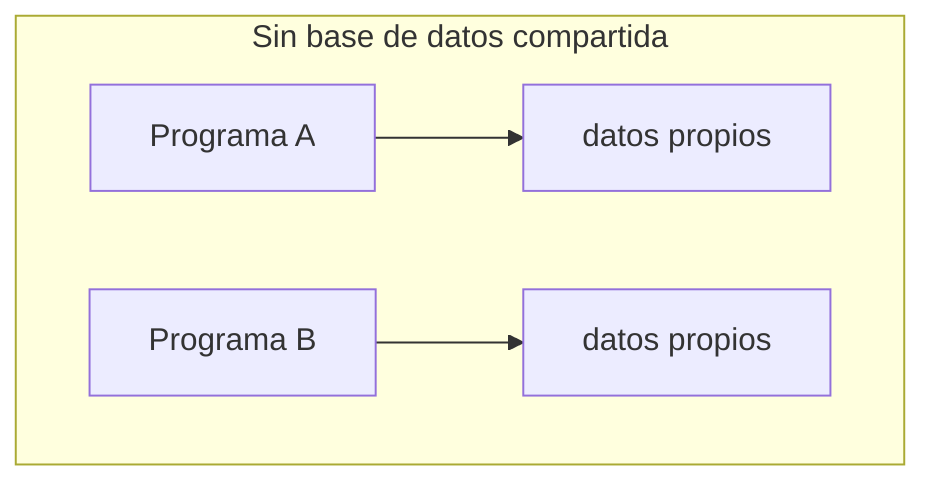
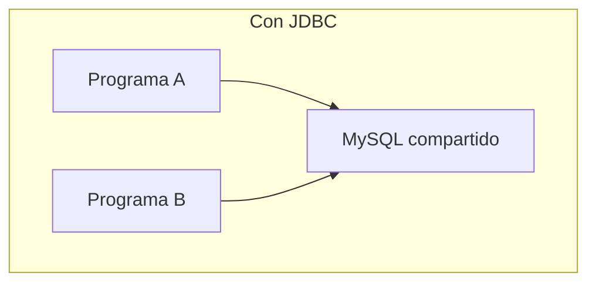
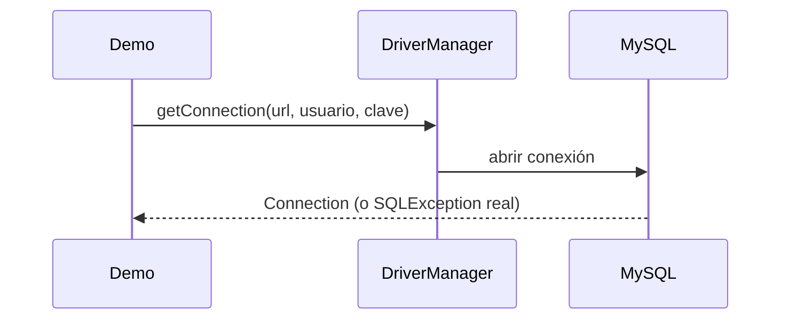
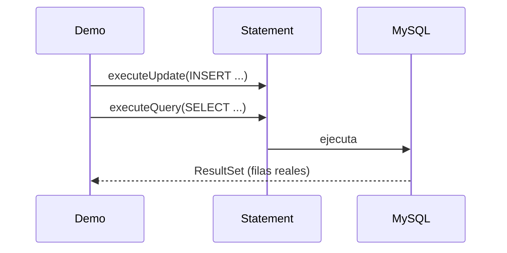
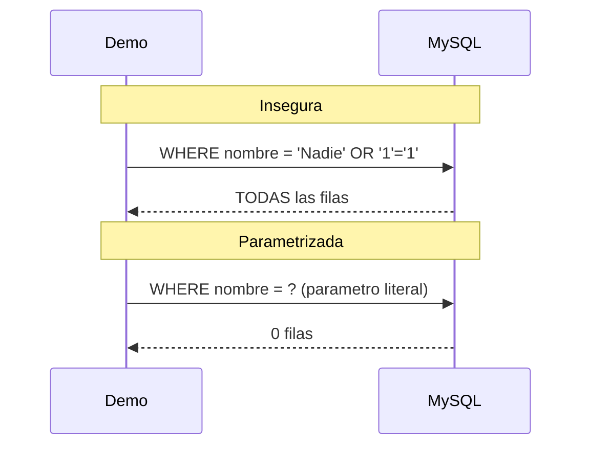
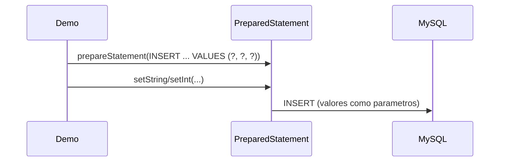
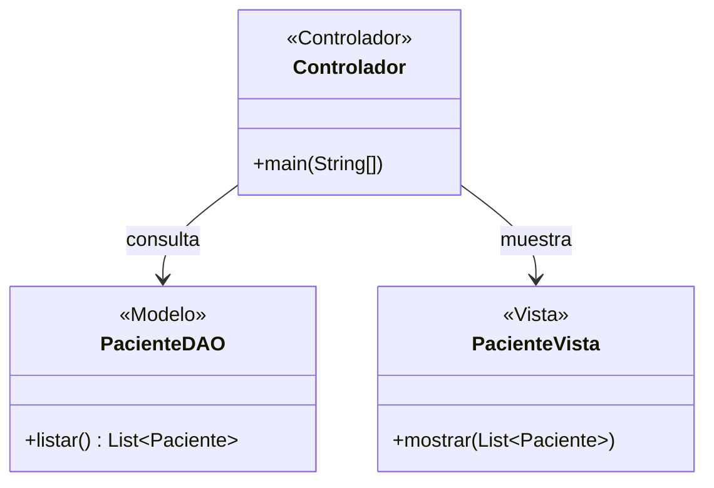

# Módulo 18 — Java DataBase Connectivity

Curso de Java
---
## 🎯 Objetivos del módulo

- Conectarse a una base de datos MySQL con JDBC y ejecutar consultas con `Statement`/`ResultSet`.
- Explicar por qué concatenar valores en una consulta SQL es inseguro, y evitarlo con consultas
  parametrizadas.
- Implementar las cuatro operaciones básicas con `PreparedStatement`.
- Organizar un proyecto que accede a datos con la arquitectura Modelo-Vista-Controlador.
---
## 🗺️ Ruta de la sesión

1. ¿Qué es JDBC? (configuración del controlador, uso de JDBC, consultas parametrizadas,
   `PreparedStatement`).
2. Arquitectura Modelo-Vista-Controlador (MVC) en un proyecto Java.
---
## 🌍 Por qué conectarse a una base de datos

Hasta el Módulo 17, cada programa guardaba sus datos en archivos locales, aislados del resto. Cuando
varios programas necesitan compartir los mismos datos actualizados, hace falta una base de datos real.
---
## 🧠 ¿Qué es JDBC?

**JDBC** (Java DataBase Connectivity) es la API estándar de Java para conectarse a una base de datos
relacional y ejecutar SQL contra ella. Este módulo usa MySQL como motor.
---
## 🗺️ Diagrama: sin base de datos vs. con JDBC




---
## 🧵 Configuración del controlador y conexión

Para conectarse a MySQL hacen falta tres cosas: el controlador (`mysql-connector-j`) en el classpath de
ejecución, una URL de conexión, y credenciales.
---
## 🗺️ Diagrama: flujo de conexión


---
## 💻 Conexión — antes

```java
String[] pacientes = {"Ana Torres", "Luis Rios"};
// lista fija, nunca refleja cambios reales de la base
```
---
## 💻 Conexión — después

```java
try (Connection conexion = DriverManager.getConnection(URL, USUARIO, CLAVE);
     Statement sentencia = conexion.createStatement();
     ResultSet resultado = sentencia.executeQuery("SELECT nombre FROM pacientes")) {
    // datos reales, siempre actualizados
}
```
---
## 🔍 Conexión — la prueba concreta

La versión "antes" siempre muestra los mismos dos nombres, sin importar qué haya realmente en la base.
La versión "después" consulta la tabla real (3 filas) y maneja con una `SQLException` real el caso de una
conexión con datos incorrectos.
---
## 🧵 Uso de JDBC

`Statement` ejecuta sentencias SQL: `executeQuery()` para `SELECT` (devuelve un `ResultSet`),
`executeUpdate()` para `INSERT`/`UPDATE`/`DELETE` (devuelve la cantidad de filas afectadas).
---
## 🗺️ Diagrama: Statement y ResultSet


---
## 💻 Uso de JDBC — antes

```java
System.out.println("Registrando: Carlos Mena, 40, Asma");
// solo un mensaje, nada queda guardado
```
---
## 💻 Uso de JDBC — después

```java
sentencia.executeUpdate(
    "INSERT INTO pacientes (nombre, edad, diagnostico) VALUES ('Carlos Mena', 40, 'Asma')",
    Statement.RETURN_GENERATED_KEYS);
// el INSERT queda confirmado consultando la tabla real
```
---
## 🔍 Uso de JDBC — la prueba concreta

Consultar la tabla inmediatamente después del `INSERT` muestra una fila más; después del `DELETE`, la
tabla vuelve a su estado original — cada paso confirmado contra la base real.
---
## 🧵 Consultas parametrizadas

Concatenar un valor externo en el texto SQL es inseguro: ese valor puede alterar el significado real de
la consulta (inyección SQL). Una consulta parametrizada pasa el valor por separado, con un marcador `?`.
---
## 🗺️ Diagrama: inyección SQL vs. consulta parametrizada


---
## 💻 Consultas parametrizadas — antes

```java
String sql = "SELECT nombre FROM pacientes WHERE nombre = '" + nombreBuscado + "'";
// nombreBuscado = "Nadie' OR '1'='1" altera la consulta real
```
---
## 💻 Consultas parametrizadas — después

```java
PreparedStatement sentencia = conexion.prepareStatement("SELECT nombre FROM pacientes WHERE nombre = ?");
sentencia.setString(1, nombreBuscado);
// el mismo valor se trata como texto literal
```
---
## 🔍 Consultas parametrizadas — la prueba concreta

Con el valor `"Nadie' OR '1'='1"`: la versión insegura devuelve las 3 filas de la tabla completa (una
inyección SQL real y explotada); la parametrizada devuelve 0 filas, el resultado correcto.
---
## 🧵 Operaciones con PreparedStatement

Las cuatro operaciones (consultar, insertar, actualizar, borrar) se implementan igual con
`PreparedStatement`: se declara la consulta una vez, con `?`, y se asigna cada valor con `setX()`.
---
## 🗺️ Diagrama: CRUD con PreparedStatement


---
## 💻 PreparedStatement — antes

```java
sentencia.executeUpdate(
    "INSERT INTO pacientes (nombre, edad, diagnostico) VALUES ('"
        + nombre + "', " + edad + ", '" + diagnostico + "')");
// concatenacion a mano, inseguro y verboso
```
---
## 💻 PreparedStatement — después

```java
PreparedStatement insertar = conexion.prepareStatement(
    "INSERT INTO pacientes (nombre, edad, diagnostico) VALUES (?, ?, ?)");
insertar.setString(1, nombre);
insertar.setInt(2, edad);
insertar.setString(3, diagnostico);
```
---
## 🔍 PreparedStatement — la prueba concreta

Ambas versiones producen el mismo resultado final sobre la tabla, pero la versión parametrizada es más
corta, más segura, y sin conversión manual de tipos a texto.
---
## 🧵 Arquitectura MVC

MVC organiza un programa en tres capas: **Modelo** (datos y acceso a ellos), **Vista** (presentación),
**Controlador** (coordinación entre ambos).
---
## 🧵 Arquitectura MVC en un proyecto Java

Aplicar MVC significa declarar clases o paquetes separados por capa (`modelo/`, `vista/`,
`controlador/`). Reorganizar un programa en capas no cambia su comportamiento observable.
---
## 🗺️ Diagrama: capas MVC


---
## 💻 MVC — antes

```java
try (Connection conexion = DriverManager.getConnection(URL, USUARIO, CLAVE);
     Statement sentencia = conexion.createStatement();
     ResultSet resultado = sentencia.executeQuery("SELECT ...")) {
    while (resultado.next()) System.out.println(...); // todo mezclado
}
```
---
## 💻 MVC — después

```java
PacienteDAO modelo = new PacienteDAO();
PacienteVista vista = new PacienteVista();
vista.mostrar(modelo.listar()); // cada capa, su responsabilidad
```
---
## 🔍 MVC — la prueba concreta

Ambas versiones producen exactamente la misma salida, verificable ejecutando las dos: la reorganización
cambia la estructura interna, no el comportamiento observable.
---
## ⚠️ Errores frecuentes de este módulo

- No manejar la `SQLException` de una conexión o consulta que puede fallar.
- Concatenar cualquier valor externo directamente en el texto SQL.
- No cerrar `Connection`/`Statement`/`ResultSet` (no usar try-with-resources).
- Parametrizar solo algunas operaciones y seguir concatenando en las demás.
- Que el Controlador ejecute SQL o imprima directamente, en vez de coordinar Modelo y Vista.
---
## 📋 Resumen de las herramientas

| Herramienta | Qué resuelve |
|---|---|
| `DriverManager.getConnection()` | Abre una conexión real a MySQL |
| `Statement` + `ResultSet` | Ejecuta SQL simple, sin valores externos |
| Consulta parametrizada | Evita que un valor externo altere el SQL |
| `PreparedStatement` | Ejecuta SQL parametrizado, de forma segura |
| Arquitectura MVC | Separa datos, presentación y coordinación |
---
## 🛠️ Taller: MediSalud

**Taller 01** (Gestión de Pacientes): persiste datos en MySQL con `PreparedStatement`, organizado en
capas Modelo-Vista-Controlador.
---
## 🧪 Ejercicios: Biblioteca Universitaria

Un ejercicio Básico (identificar la violación) y uno Intermedio (aplicar la herramienta) por cada uno de
los cinco sub-temas técnicos, con la Biblioteca Universitaria como dominio.
---
## 🔴🏆 Avanzado y Desafío: Biblioteca Universitaria

**Avanzado 01**: corregir un diseño con dos sub-temas ausentes (consultas inseguras + capas mezcladas).
**Desafío 01**: sin scaffold, diseñar un sistema nuevo que combine JDBC y MVC.
---
## ❓ Quiz 01

8 preguntas en formato entrevista técnica: una por cada resultado de aprendizaje, con la última
integradora sobre cómo combinar JDBC y MVC.
---
## 📚 Repaso: la pregunta clave de cada herramienta

- **Conexión**: ¿mi programa ya se conecta a una base de datos real?
- **Statement**: ¿esta consulta no incorpora ningún valor externo?
- **PreparedStatement**: ¿esta operación incorpora un valor externo?
- **MVC**: ¿esta clase mezcla acceso a datos, lógica y presentación?
---
## ✅ Checklist de cierre

- Puedo conectarme a MySQL con JDBC y ejecutar consultas con `Statement`/`ResultSet`.
- Puedo explicar por qué una consulta insegura es un riesgo real, y corregirla con `PreparedStatement`.
- Puedo organizar un proyecto en capas Modelo-Vista-Controlador.
- Completé el taller, los ejercicios Básico e Intermedio de los cinco sub-temas, y el Quiz 01.
---
## 🎓 Cierre

Conectarse a una base de datos real es solo el primer paso: hacerlo de forma segura, con
`PreparedStatement`, y organizar ese acceso en capas claras, es lo que hace un proyecto mantenible a
largo plazo.
