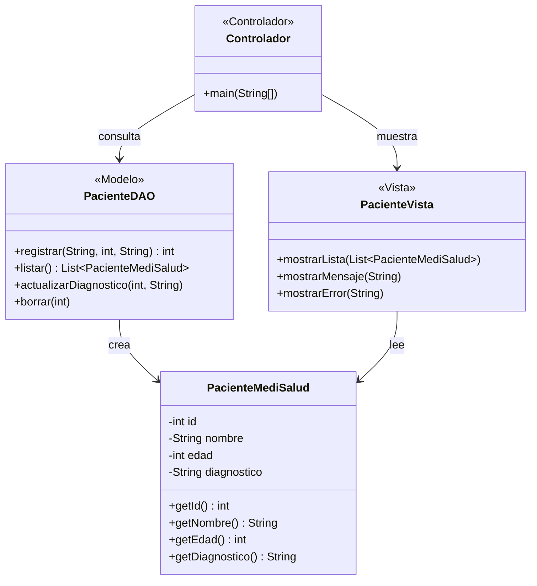

# 🔑 Solución del Taller 01 — Sistema de Gestión de Pacientes de MediSalud con JDBC y MVC

> Material docente, no enlazar desde la audiencia estudiante.

## 🗺️ Diagrama de clases



## 🌳 Árbol de archivos

```text
GestionPacientesMediSalud/
└── com/medisalud/
    ├── modelo/
    │   ├── PacienteMediSalud.java
    │   └── PacienteDAO.java
    ├── vista/
    │   └── PacienteVista.java
    └── controlador/
        └── Controlador.java
```

## 💻 Código completo

```java
package com.medisalud.modelo;

public class PacienteMediSalud {
    private final int id;
    private final String nombre;
    private final int edad;
    private final String diagnostico;

    public PacienteMediSalud(int id, String nombre, int edad, String diagnostico) {
        this.id = id;
        this.nombre = nombre;
        this.edad = edad;
        this.diagnostico = diagnostico;
    }

    public int getId() {
        return id;
    }

    public String getNombre() {
        return nombre;
    }

    public int getEdad() {
        return edad;
    }

    public String getDiagnostico() {
        return diagnostico;
    }
}
```

```java
package com.medisalud.modelo;

import java.sql.Connection;
import java.sql.DriverManager;
import java.sql.PreparedStatement;
import java.sql.ResultSet;
import java.sql.SQLException;
import java.sql.Statement;
import java.util.ArrayList;
import java.util.List;

public class PacienteDAO {
    private static final String URL = "jdbc:mysql://localhost:3306/medisalud";
    private static final String USUARIO = "root";
    private static final String CLAVE = "curso_java_root";

    public int registrar(String nombre, int edad, String diagnostico) throws SQLException {
        try (Connection conexion = DriverManager.getConnection(URL, USUARIO, CLAVE);
             PreparedStatement insertar = conexion.prepareStatement(
                     "INSERT INTO pacientes (nombre, edad, diagnostico) VALUES (?, ?, ?)",
                     Statement.RETURN_GENERATED_KEYS)) {
            insertar.setString(1, nombre);
            insertar.setInt(2, edad);
            insertar.setString(3, diagnostico);
            insertar.executeUpdate();
            try (ResultSet claves = insertar.getGeneratedKeys()) {
                claves.next();
                return claves.getInt(1);
            }
        }
    }

    public List<PacienteMediSalud> listar() throws SQLException {
        List<PacienteMediSalud> pacientes = new ArrayList<>();
        try (Connection conexion = DriverManager.getConnection(URL, USUARIO, CLAVE);
             Statement sentencia = conexion.createStatement();
             ResultSet resultado = sentencia.executeQuery(
                     "SELECT id, nombre, edad, diagnostico FROM pacientes ORDER BY id")) {
            while (resultado.next()) {
                pacientes.add(new PacienteMediSalud(resultado.getInt("id"), resultado.getString("nombre"),
                        resultado.getInt("edad"), resultado.getString("diagnostico")));
            }
        }
        return pacientes;
    }

    public void actualizarDiagnostico(int id, String nuevoDiagnostico) throws SQLException {
        try (Connection conexion = DriverManager.getConnection(URL, USUARIO, CLAVE);
             PreparedStatement actualizar = conexion.prepareStatement(
                     "UPDATE pacientes SET diagnostico = ? WHERE id = ?")) {
            actualizar.setString(1, nuevoDiagnostico);
            actualizar.setInt(2, id);
            actualizar.executeUpdate();
        }
    }

    public void borrar(int id) throws SQLException {
        try (Connection conexion = DriverManager.getConnection(URL, USUARIO, CLAVE);
             PreparedStatement borrar = conexion.prepareStatement("DELETE FROM pacientes WHERE id = ?")) {
            borrar.setInt(1, id);
            borrar.executeUpdate();
        }
    }
}
```

```java
package com.medisalud.vista;

import com.medisalud.modelo.PacienteMediSalud;
import java.util.List;

public class PacienteVista {

    public void mostrarLista(List<PacienteMediSalud> pacientes) {
        System.out.println("=== Pacientes de MediSalud ===");
        for (PacienteMediSalud paciente : pacientes) {
            System.out.println(paciente.getNombre() + " (" + paciente.getEdad()
                    + " anios) - " + paciente.getDiagnostico());
        }
    }

    public void mostrarMensaje(String mensaje) {
        System.out.println(mensaje);
    }

    public void mostrarError(String mensaje) {
        System.out.println("Error real de base de datos: " + mensaje);
    }
}
```

```java
package com.medisalud.controlador;

import com.medisalud.modelo.PacienteDAO;
import com.medisalud.vista.PacienteVista;
import java.sql.SQLException;

public class Controlador {
    public static void main(String[] args) {
        PacienteDAO modelo = new PacienteDAO();
        PacienteVista vista = new PacienteVista();

        try {
            int id = modelo.registrar("Julian Moreno", 52, "Diabetes");
            vista.mostrarMensaje("Paciente registrado. Lista completa:");
            vista.mostrarLista(modelo.listar());

            modelo.actualizarDiagnostico(id, "Diabetes controlada");
            vista.mostrarMensaje("Diagnostico actualizado. Lista completa:");
            vista.mostrarLista(modelo.listar());

            modelo.borrar(id);
            vista.mostrarMensaje("Paciente de prueba borrado. Lista completa (vuelve al estado original):");
            vista.mostrarLista(modelo.listar());
        } catch (SQLException e) {
            vista.mostrarError(e.getMessage());
        }
    }
}
```

## ✅ Salida real del caso integrador

```text
Paciente registrado. Lista completa:
=== Pacientes de MediSalud ===
Ana Torres (34 anios) - Gripe
Luis Rios (45 anios) - Hipertension
Marta Diaz (29 anios) - Migrana
Julian Moreno (52 anios) - Diabetes
Diagnostico actualizado. Lista completa:
=== Pacientes de MediSalud ===
Ana Torres (34 anios) - Gripe
Luis Rios (45 anios) - Hipertension
Marta Diaz (29 anios) - Migrana
Julian Moreno (52 anios) - Diabetes controlada
Paciente de prueba borrado. Lista completa (vuelve al estado original):
=== Pacientes de MediSalud ===
Ana Torres (34 anios) - Gripe
Luis Rios (45 anios) - Hipertension
Marta Diaz (29 anios) - Migrana
```

## ⚠️ Errores comunes

- **Concatenar valores en el Modelo**: usar `"... WHERE id = " + id` en vez de `PreparedStatement` con
  `?`, perdiendo la protección contra inyección SQL justo en la capa que más la necesita.
- **Vista con lógica de acceso a datos**: hacer que `PacienteVista` reciba un `ResultSet` en vez de una
  lista de objetos `PacienteMediSalud` ya construidos, acoplando la presentación a JDBC.
- **Controlador que imprime directamente**: usar `System.out.println()` dentro del Controlador en vez de
  delegarlo a la Vista, mezclando coordinación con presentación.
- **No cerrar recursos**: no usar try-with-resources en `Connection`/`PreparedStatement`/`ResultSet`,
  dejando conexiones abiertas innecesariamente.
