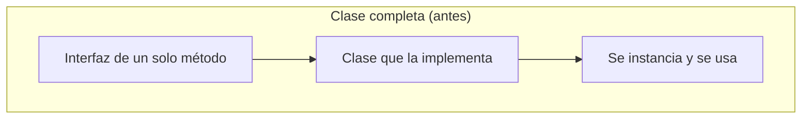
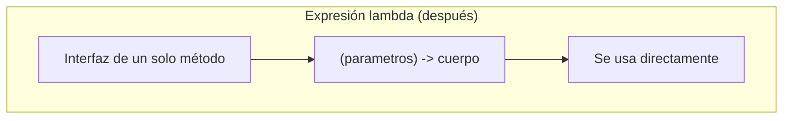

# 💡 Ejemplo 01 — ¿Qué son las expresiones lambda?

## 🌍 Contexto

MediSalud tiene un programa que, para cada paciente de una lista, ejecuta una acción simple (por ejemplo,
imprimir sus datos). Hoy esa acción está implementada con una clase completa que implementa una interfaz
de un solo método — mucho código para algo tan simple.

## 🗺️ Diagrama

*Arriba: implementar una interfaz de un solo método exige declarar una clase completa aparte. Abajo: una
expresión lambda implementa esa misma interfaz en una sola línea, sin declarar ninguna clase.*

## 🧭 Explicación paso a paso

1. Muchas interfaces de Java declaran un único método abstracto (por ejemplo, una interfaz con un solo
   método `ejecutar(...)`). Se las llama **interfaces funcionales**.
2. Antes de Java 8, la única forma de implementar una interfaz así "al vuelo" era con una clase completa
   o con una clase anónima — código repetitivo para una lógica que, muchas veces, es una sola línea.
3. Una **expresión lambda** es una forma concisa de implementar una interfaz funcional:
   `(parámetros) -> cuerpo`. El compilador infiere, por el contexto, a qué interfaz corresponde.
4. Una expresión lambda no es un mecanismo nuevo ni mágico: es exactamente lo mismo que una clase (o una
   clase anónima) que implementa esa interfaz, escrito de forma más breve.
5. Este módulo cubre cuatro interfaces funcionales estándar de `java.util.function`
   (`Consumer`, `Supplier`, `Function`, `Predicate`) y cómo diseñar interfaces funcionales propias cuando
   ninguna de esas cuatro se ajusta al problema.

## ✅ Resultado esperado

Un programa de MediSalud que imprime cada paciente de una lista, implementado primero con una clase
completa, y después con una expresión lambda: ambas versiones producen exactamente la misma salida por
consola, pero la segunda tiene muchas menos líneas de código.

## ❓ Preguntas de repaso

**1. [Selección]** ¿Qué es una expresión lambda?

- A. Un tipo de dato nuevo de Java, distinto de una clase o una interfaz.
- B. Una forma concisa de implementar una interfaz de un único método abstracto.
- C. Un mecanismo exclusivo de las interfaces `Consumer` y `Supplier`.
- D. Una forma de declarar una clase sin nombre.

🔑 Ver respuesta

**Respuesta correcta: B.** Una expresión lambda implementa una interfaz funcional (de un único método
abstracto) de forma concisa; no es un tipo de dato nuevo ni está limitado a interfaces específicas.

**2. [Selección múltiple]** ¿Cuáles de las siguientes afirmaciones sobre las expresiones lambda son
verdaderas?

- A. Solo se pueden usar con interfaces que declaran exactamente un método abstracto.
- B. Una expresión lambda y una clase que implementa la misma interfaz producen el mismo resultado.
- C. Las expresiones lambda reemplazan la necesidad de usar interfaces en Java.
- D. `(parámetros) -> cuerpo` es la sintaxis general de una expresión lambda.

🔑 Ver respuesta

**Respuestas correctas: A, B y D.** C es falsa: las expresiones lambda siguen necesitando una interfaz
funcional de base; no eliminan el uso de interfaces, lo hacen más conciso.

**3. [Abierta]** Un compañero dice: "las expresiones lambda son un mecanismo completamente distinto de
las clases e interfaces que ya conozco". ¿Estás de acuerdo? Justifica tu respuesta.

🔑 Ver respuesta

No. Una expresión lambda implementa una interfaz funcional existente, exactamente igual que lo haría una
clase (o una clase anónima); es una forma más concisa de escribir lo mismo, no un mecanismo aparte del
sistema de tipos de Java.

