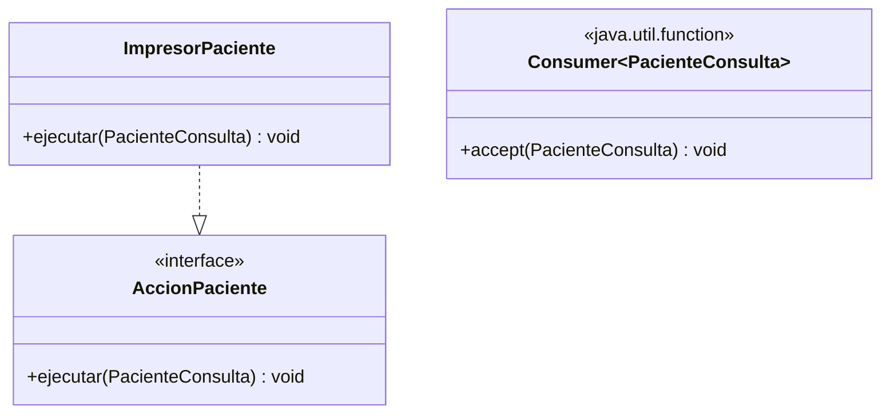

# 💡 Ejemplo 02 — Consumer

## 🌍 Contexto

MediSalud llama a cada paciente de una lista, uno por uno, para confirmar su turno. Hoy esa acción está
implementada con una interfaz de un solo método (`AccionPaciente`) y una clase completa
(`ImpresorPaciente`).

**Qué busca demostrar este ejemplo**: cómo usar `Consumer<T>` para ejecutar una acción sobre un valor,
sin devolver ningún resultado, con una expresión lambda.

## 🏥 Caso de estudio

MediSalud recorre la lista de pacientes del día y ejecuta una acción (llamarlos) sobre cada uno.

## 🗺️ Diagrama



## 🌳 Árbol de archivos — antes

```text
consumer-antes/
└── com/medisalud/
    ├── PacienteConsulta.java
    ├── AccionPaciente.java
    ├── ImpresorPaciente.java
    └── Demo.java
```

## 💻 Archivo: PacienteConsulta.java

```java
package com.medisalud;

public class PacienteConsulta {
    private final String nombre;
    private final int edad;

    public PacienteConsulta(String nombre, int edad) {
        this.nombre = nombre;
        this.edad = edad;
    }

    public String getNombre() {
        return nombre;
    }

    public int getEdad() {
        return edad;
    }
}
```

## 💻 Archivo: AccionPaciente.java

```java
package com.medisalud;

public interface AccionPaciente {
    void ejecutar(PacienteConsulta paciente);
}
```

## 💻 Archivo: ImpresorPaciente.java

```java
package com.medisalud;

public class ImpresorPaciente implements AccionPaciente {
    @Override
    public void ejecutar(PacienteConsulta paciente) {
        System.out.println("Llamando a: " + paciente.getNombre() + " (" + paciente.getEdad() + " anios)");
    }
}
```

## 💻 Archivo: Demo.java

```java
package com.medisalud;

import java.util.ArrayList;
import java.util.List;

public class Demo {
    public static void main(String[] args) {
        List<PacienteConsulta> pacientes = new ArrayList<>();
        pacientes.add(new PacienteConsulta("Ana Torres", 34));
        pacientes.add(new PacienteConsulta("Luis Rios", 45));

        AccionPaciente accion = new ImpresorPaciente();
        for (PacienteConsulta paciente : pacientes) {
            accion.ejecutar(paciente);
        }
    }
}
```

## ✅ Resultado esperado — antes

```text
Llamando a: Ana Torres (34 anios)
Llamando a: Luis Rios (45 anios)
```

## 🌳 Árbol de archivos — después

```text
consumer-despues/
├── PacienteConsulta.java        (sin cambios)
└── Demo.java                    (cambió)
```

## 💻 Archivo: PacienteConsulta.java

```java
package com.medisalud;

public class PacienteConsulta {
    private final String nombre;
    private final int edad;

    public PacienteConsulta(String nombre, int edad) {
        this.nombre = nombre;
        this.edad = edad;
    }

    public String getNombre() {
        return nombre;
    }

    public int getEdad() {
        return edad;
    }
}
```

## 💻 Archivo: Demo.java — cambió

```java
package com.medisalud;

import java.util.ArrayList;
import java.util.List;
import java.util.function.Consumer;

public class Demo {
    public static void main(String[] args) {
        List<PacienteConsulta> pacientes = new ArrayList<>();
        pacientes.add(new PacienteConsulta("Ana Torres", 34));
        pacientes.add(new PacienteConsulta("Luis Rios", 45));

        Consumer<PacienteConsulta> accion = paciente ->
                System.out.println("Llamando a: " + paciente.getNombre() + " (" + paciente.getEdad() + " anios)");
        for (PacienteConsulta paciente : pacientes) {
            accion.accept(paciente);
        }
    }
}
```

## ✅ Resultado esperado — después

```text
Llamando a: Ana Torres (34 anios)
Llamando a: Luis Rios (45 anios)
```

## 🔍 Comparación: la prueba concreta

Ambas versiones producen exactamente la misma salida para los dos pacientes de la lista, verificable
ejecutando las dos. La versión "antes" necesita dos archivos adicionales (`AccionPaciente.java`,
`ImpresorPaciente.java`) solo para declarar una acción de una línea. La versión "después" usa
`Consumer<PacienteConsulta>`, una interfaz funcional ya provista por Java, y la implementa directamente
con una expresión lambda — sin declarar ninguna interfaz ni clase nueva.

## 🔍 Análisis: errores frecuentes

El error más frecuente es declarar una interfaz propia de un solo método para un caso que ya cubre
`Consumer<T>` (una acción que recibe un valor y no devuelve nada). Antes de diseñar una interfaz propia
(Ejemplo 06), conviene revisar si alguna de las cuatro interfaces estándar ya resuelve el caso.

## ❓ Preguntas de repaso

**1. [Selección]** ¿Qué método declara la interfaz `Consumer<T>`?

- A. `T get()`
- B. `void accept(T t)`
- C. `R apply(T t)`
- D. `boolean test(T t)`

<details>
<summary>🔑 Ver respuesta</summary>

**Respuesta correcta: B.** `Consumer<T>` declara `accept(T t)`: recibe un valor y no devuelve nada
(`void`).

</details>

**2. [Selección múltiple]** Sobre este ejemplo, ¿cuáles afirmaciones son verdaderas?

- A. `Consumer<PacienteConsulta>` reemplaza tanto a la interfaz `AccionPaciente` como a la clase
  `ImpresorPaciente`.
- B. Ambas versiones producen exactamente la misma salida.
- C. `Consumer<T>` devuelve un valor transformado a partir de `T`.
- D. La expresión lambda de la versión "después" recibe un `PacienteConsulta` y no devuelve nada.

<details>
<summary>🔑 Ver respuesta</summary>

**Respuestas correctas: A, B y D.** C es falsa: `Consumer<T>` nunca devuelve un valor (su método es
`void`); transformar y devolver un valor es responsabilidad de `Function<T, R>` (Ejemplo 04).

</details>

**3. [Abierta]** Un compañero dice: "para cualquier acción de un solo método, siempre conviene declarar
mi propia interfaz, así el nombre del método queda más claro". ¿Estás de acuerdo? Justifica tu respuesta.

<details>
<summary>🔑 Ver respuesta</summary>

No siempre. Si la acción simplemente recibe un valor y no devuelve nada, `Consumer<T>` ya resuelve el
caso, sin necesitar declarar ninguna interfaz ni clase nueva. Diseñar una interfaz propia (Ejemplo 06)
tiene sentido cuando el caso no encaja en ninguna interfaz estándar, no como preferencia de nombres.

</details>
