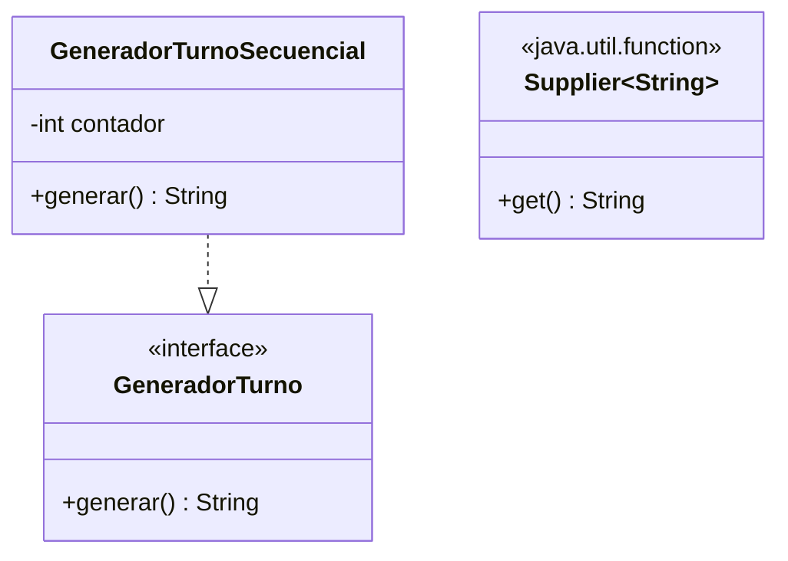

# 💡 Ejemplo 03 — Supplier

## 🌍 Contexto

MediSalud necesita generar un código de turno cada vez que un paciente llega sin uno asignado. Hoy esa
generación está implementada con una interfaz de un solo método (`GeneradorTurno`) y una clase completa
(`GeneradorTurnoSecuencial`).

**Qué busca demostrar este ejemplo**: cómo usar `Supplier<T>` para proveer un valor bajo demanda, sin
recibir ningún parámetro, con una expresión lambda.

## 🏥 Caso de estudio

MediSalud genera un código de turno nuevo cada vez que lo necesita, sin recibir ningún dato de entrada.

## 🗺️ Diagrama



## 🌳 Árbol de archivos — antes

```text
supplier-antes/
└── com/medisalud/
    ├── GeneradorTurno.java
    ├── GeneradorTurnoSecuencial.java
    └── Demo.java
```

## 💻 Archivo: GeneradorTurno.java

```java
package com.medisalud;

public interface GeneradorTurno {
    String generar();
}
```

## 💻 Archivo: GeneradorTurnoSecuencial.java

```java
package com.medisalud;

public class GeneradorTurnoSecuencial implements GeneradorTurno {
    private int contador = 0;

    @Override
    public String generar() {
        contador++;
        return "TURNO-" + contador;
    }
}
```

## 💻 Archivo: Demo.java

```java
package com.medisalud;

public class Demo {
    public static void main(String[] args) {
        GeneradorTurno generador = new GeneradorTurnoSecuencial();
        System.out.println(generador.generar());
        System.out.println(generador.generar());
        System.out.println(generador.generar());
    }
}
```

## ✅ Resultado esperado — antes

```text
TURNO-1
TURNO-2
TURNO-3
```

## 🌳 Árbol de archivos — después

```text
supplier-despues/
└── com/medisalud/
    └── Demo.java                (cambió)
```

## 💻 Archivo: Demo.java — cambió

```java
package com.medisalud;

import java.util.function.Supplier;

public class Demo {
    private static int contador = 0;

    public static void main(String[] args) {
        Supplier<String> generador = () -> "TURNO-" + (++contador);
        System.out.println(generador.get());
        System.out.println(generador.get());
        System.out.println(generador.get());
    }
}
```

## ✅ Resultado esperado — después

```text
TURNO-1
TURNO-2
TURNO-3
```

## 🔍 Comparación: la prueba concreta

Ambas versiones generan exactamente la misma secuencia de códigos (`TURNO-1`, `TURNO-2`, `TURNO-3`),
verificable ejecutando las dos. La versión "antes" necesita una interfaz y una clase completa solo para
generar un valor sin recibir ningún parámetro. La versión "después" usa `Supplier<String>`, que ya
declara ese contrato (ningún parámetro, un valor de retorno), implementado con una expresión lambda.

## 🔍 Análisis: errores frecuentes

El error más frecuente es confundir `Supplier<T>` con `Consumer<T>`: `Supplier<T>` **no recibe ningún
parámetro** y devuelve un valor (`T get()`); `Consumer<T>` **recibe un parámetro** y no devuelve nada
(`void accept(T t)`) — son formas opuestas.

## ❓ Preguntas de repaso

**1. [Selección]** ¿Qué método declara la interfaz `Supplier<T>`?

- A. `void accept(T t)`
- B. `T get()`
- C. `boolean test(T t)`
- D. `R apply(T t)`

<details>
<summary>🔑 Ver respuesta</summary>

**Respuesta correcta: B.** `Supplier<T>` declara `get()`: no recibe ningún parámetro y devuelve un valor
de tipo `T`.

</details>

**2. [Selección múltiple]** Sobre este ejemplo, ¿cuáles afirmaciones son verdaderas?

- A. `Supplier<String>` no recibe ningún parámetro.
- B. Ambas versiones generan exactamente la misma secuencia de códigos.
- C. `Supplier<T>` recibe un valor y ejecuta una acción sobre él.
- D. La expresión lambda de la versión "después" puede acceder y modificar el campo estático `contador`
  de `Demo`.

<details>
<summary>🔑 Ver respuesta</summary>

**Respuestas correctas: A, B y D.** C es falsa: eso describe a `Consumer<T>`; `Supplier<T>` no recibe
ningún parámetro.

</details>

**3. [Abierta]** Un compañero dice: "un `Supplier<T>` nunca puede cambiar ningún estado, porque no
recibe ningún parámetro". ¿Estás de acuerdo? Justifica tu respuesta.

<details>
<summary>🔑 Ver respuesta</summary>

No. Que no reciba parámetros no significa que no pueda tener efectos: en este ejemplo, cada llamada a
`generador.get()` incrementa el campo estático `contador`, cambiando un estado externo a la lambda. Lo
que garantiza `Supplier<T>` es la firma (`() -> T`), no la ausencia de efectos.

</details>
