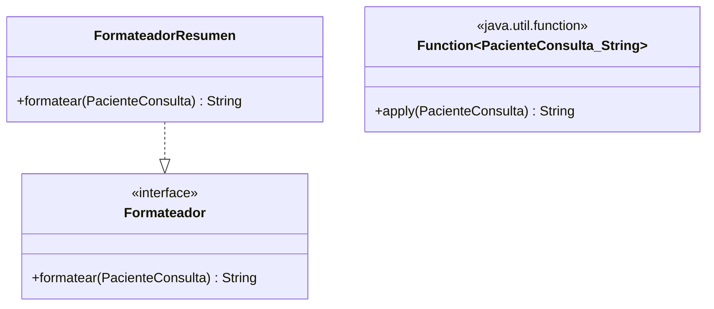

# 💡 Ejemplo 04 — Funciones lambda

## 🌍 Contexto

MediSalud necesita transformar los datos de un paciente en una línea de texto resumida, para mostrarla en
distintas pantallas. Hoy esa transformación está implementada con una interfaz de un solo método
(`Formateador`) y una clase completa (`FormateadorResumen`).

**Qué busca demostrar este ejemplo**: cómo usar `Function<T, R>` para transformar un valor de un tipo en
un valor de otro tipo, con una expresión lambda.

## 🏥 Caso de estudio

MediSalud transforma un `PacienteConsulta` en un `String` resumido con su nombre y edad.

## 🗺️ Diagrama



## 🌳 Árbol de archivos — antes

```text
function-antes/
└── com/medisalud/
    ├── PacienteConsulta.java
    ├── Formateador.java
    ├── FormateadorResumen.java
    └── Demo.java
```

## 💻 Archivo: PacienteConsulta.java

```java
package com.medisalud;

public class PacienteConsulta {
    private final String nombre;
    private final int edad;

    public PacienteConsulta(String nombre, int edad) {
        this.nombre = nombre;
        this.edad = edad;
    }

    public String getNombre() {
        return nombre;
    }

    public int getEdad() {
        return edad;
    }
}
```

## 💻 Archivo: Formateador.java

```java
package com.medisalud;

public interface Formateador {
    String formatear(PacienteConsulta paciente);
}
```

## 💻 Archivo: FormateadorResumen.java

```java
package com.medisalud;

public class FormateadorResumen implements Formateador {
    @Override
    public String formatear(PacienteConsulta paciente) {
        return paciente.getNombre() + " (" + paciente.getEdad() + " anios)";
    }
}
```

## 💻 Archivo: Demo.java

```java
package com.medisalud;

public class Demo {
    public static void main(String[] args) {
        PacienteConsulta paciente = new PacienteConsulta("Ana Torres", 34);
        Formateador formateador = new FormateadorResumen();
        System.out.println(formateador.formatear(paciente));
    }
}
```

## ✅ Resultado esperado — antes

```text
Ana Torres (34 anios)
```

## 🌳 Árbol de archivos — después

```text
function-despues/
├── PacienteConsulta.java        (sin cambios)
└── Demo.java                    (cambió)
```

## 💻 Archivo: PacienteConsulta.java

```java
package com.medisalud;

public class PacienteConsulta {
    private final String nombre;
    private final int edad;

    public PacienteConsulta(String nombre, int edad) {
        this.nombre = nombre;
        this.edad = edad;
    }

    public String getNombre() {
        return nombre;
    }

    public int getEdad() {
        return edad;
    }
}
```

## 💻 Archivo: Demo.java — cambió

```java
package com.medisalud;

import java.util.function.Function;

public class Demo {
    public static void main(String[] args) {
        PacienteConsulta paciente = new PacienteConsulta("Ana Torres", 34);
        Function<PacienteConsulta, String> formateador =
                p -> p.getNombre() + " (" + p.getEdad() + " anios)";
        System.out.println(formateador.apply(paciente));
    }
}
```

## ✅ Resultado esperado — después

```text
Ana Torres (34 anios)
```

## 🔍 Comparación: la prueba concreta

Ambas versiones producen exactamente el mismo texto resumido, verificable ejecutando las dos. La versión
"antes" necesita una interfaz y una clase completa solo para transformar un `PacienteConsulta` en un
`String`. La versión "después" usa `Function<PacienteConsulta, String>`, que ya declara ese contrato (un
valor de entrada, un valor de salida de otro tipo), implementado con una expresión lambda.

## 🔍 Análisis: errores frecuentes

El error más frecuente es confundir `Function<T, R>` con `Consumer<T>`: `Function<T, R>` **transforma**
un valor de entrada en un valor de salida (`R apply(T t)`); `Consumer<T>` solo ejecuta una acción, sin
devolver ningún resultado. Si el objetivo es obtener un valor transformado, `Function` es la interfaz
correcta, no `Consumer`.

## ❓ Preguntas de repaso

**1. [Selección]** ¿Qué método declara la interfaz `Function<T, R>`?

- A. `void accept(T t)`
- B. `T get()`
- C. `R apply(T t)`
- D. `boolean test(T t)`

<details>
<summary>🔑 Ver respuesta</summary>

**Respuesta correcta: C.** `Function<T, R>` declara `apply(T t)`: recibe un valor de tipo `T` y devuelve
un valor de tipo `R`, que puede ser distinto.

</details>

**2. [Selección múltiple]** Sobre este ejemplo, ¿cuáles afirmaciones son verdaderas?

- A. `Function<PacienteConsulta, String>` recibe un `PacienteConsulta` y devuelve un `String`.
- B. Ambas versiones producen exactamente el mismo resultado.
- C. `Function<T, R>` siempre debe recibir y devolver el mismo tipo.
- D. `T` y `R` en `Function<T, R>` pueden ser tipos distintos.

<details>
<summary>🔑 Ver respuesta</summary>

**Respuestas correctas: A, B y D.** C es falsa: `T` (entrada) y `R` (salida) pueden ser tipos distintos,
como en este ejemplo (`PacienteConsulta` → `String`).

</details>

**3. [Abierta]** Un compañero dice: "si mi método no devuelve nada, igual puedo usar `Function<T, R>`
poniendo `R` como `void`". ¿Estás de acuerdo? Justifica tu respuesta.

<details>
<summary>🔑 Ver respuesta</summary>

No. `Function<T, R>` siempre debe devolver un valor real de tipo `R`; `void` no es un tipo de objeto
válido para `R`. Si el método no devuelve nada, la interfaz correcta es `Consumer<T>`, no `Function`.

</details>
