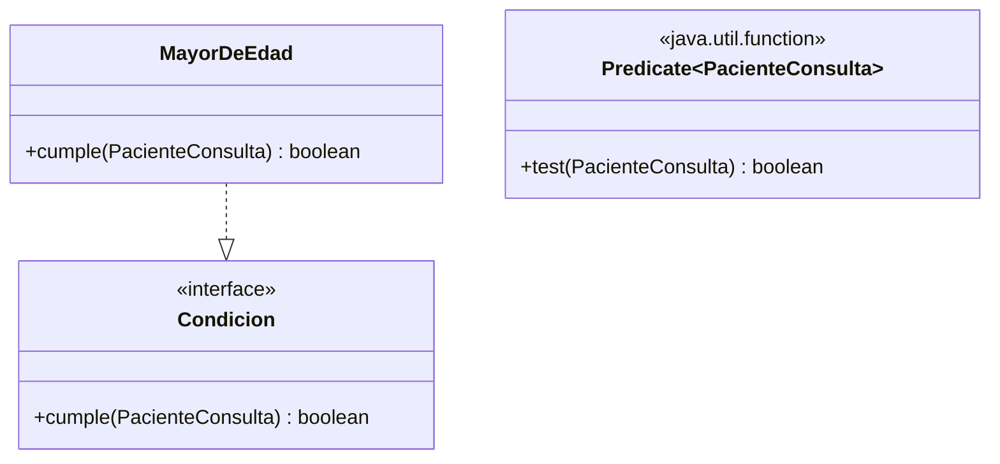

# 💡 Ejemplo 05 — Predicate

## 🌍 Contexto

MediSalud necesita filtrar, de una lista de pacientes, cuáles cumplen una condición (por ejemplo, ser
mayores de cierta edad). Hoy esa condición está implementada con una interfaz de un solo método
(`Condicion`) y una clase completa (`MayorDeEdad`).

**Qué busca demostrar este ejemplo**: cómo usar `Predicate<T>` para evaluar una condición booleana sobre
un valor, con una expresión lambda.

## 🏥 Caso de estudio

MediSalud filtra los pacientes de una lista que cumplen una condición sobre su edad.

## 🗺️ Diagrama



## 🌳 Árbol de archivos — antes

```text
predicate-antes/
└── com/medisalud/
    ├── PacienteConsulta.java
    ├── Condicion.java
    ├── MayorDeEdad.java
    └── Demo.java
```

## 💻 Archivo: PacienteConsulta.java

```java
package com.medisalud;

public class PacienteConsulta {
    private final String nombre;
    private final int edad;

    public PacienteConsulta(String nombre, int edad) {
        this.nombre = nombre;
        this.edad = edad;
    }

    public String getNombre() {
        return nombre;
    }

    public int getEdad() {
        return edad;
    }
}
```

## 💻 Archivo: Condicion.java

```java
package com.medisalud;

public interface Condicion {
    boolean cumple(PacienteConsulta paciente);
}
```

## 💻 Archivo: MayorDeEdad.java

```java
package com.medisalud;

public class MayorDeEdad implements Condicion {
    @Override
    public boolean cumple(PacienteConsulta paciente) {
        return paciente.getEdad() >= 40;
    }
}
```

## 💻 Archivo: Demo.java

```java
package com.medisalud;

import java.util.ArrayList;
import java.util.List;

public class Demo {
    public static void main(String[] args) {
        List<PacienteConsulta> pacientes = new ArrayList<>();
        pacientes.add(new PacienteConsulta("Ana Torres", 34));
        pacientes.add(new PacienteConsulta("Luis Rios", 45));

        Condicion condicion = new MayorDeEdad();
        for (PacienteConsulta paciente : pacientes) {
            if (condicion.cumple(paciente)) {
                System.out.println(paciente.getNombre());
            }
        }
    }
}
```

## ✅ Resultado esperado — antes

```text
Luis Rios
```

## 🌳 Árbol de archivos — después

```text
predicate-despues/
├── PacienteConsulta.java        (sin cambios)
└── Demo.java                    (cambió)
```

## 💻 Archivo: PacienteConsulta.java

```java
package com.medisalud;

public class PacienteConsulta {
    private final String nombre;
    private final int edad;

    public PacienteConsulta(String nombre, int edad) {
        this.nombre = nombre;
        this.edad = edad;
    }

    public String getNombre() {
        return nombre;
    }

    public int getEdad() {
        return edad;
    }
}
```

## 💻 Archivo: Demo.java — cambió

```java
package com.medisalud;

import java.util.ArrayList;
import java.util.List;
import java.util.function.Predicate;

public class Demo {
    public static void main(String[] args) {
        List<PacienteConsulta> pacientes = new ArrayList<>();
        pacientes.add(new PacienteConsulta("Ana Torres", 34));
        pacientes.add(new PacienteConsulta("Luis Rios", 45));

        Predicate<PacienteConsulta> condicion = paciente -> paciente.getEdad() >= 40;
        for (PacienteConsulta paciente : pacientes) {
            if (condicion.test(paciente)) {
                System.out.println(paciente.getNombre());
            }
        }
    }
}
```

## ✅ Resultado esperado — después

```text
Luis Rios
```

## 🔍 Comparación: la prueba concreta

Ambas versiones filtran exactamente el mismo paciente (el único mayor de 40 años), verificable ejecutando
las dos. La versión "antes" necesita una interfaz y una clase completa solo para evaluar una condición
booleana. La versión "después" usa `Predicate<PacienteConsulta>`, que ya declara ese contrato (un valor
de entrada, un `boolean` de salida), implementado con una expresión lambda.

## 🔍 Análisis: errores frecuentes

El error más frecuente es confundir `Predicate<T>` con `Function<T, R>`: `Predicate<T>` siempre devuelve
un `boolean` (`test(T t)`); `Function<T, R>` puede devolver cualquier tipo `R`. Si el objetivo es evaluar
una condición verdadero/falso, `Predicate` es la interfaz correcta, no `Function<T, Boolean>`.

## ❓ Preguntas de repaso

**1. [Selección]** ¿Qué método declara la interfaz `Predicate<T>`?

- A. `R apply(T t)`
- B. `T get()`
- C. `boolean test(T t)`
- D. `void accept(T t)`

<details>
<summary>🔑 Ver respuesta</summary>

**Respuesta correcta: C.** `Predicate<T>` declara `test(T t)`: recibe un valor y devuelve un `boolean`,
evaluando una condición.

</details>

**2. [Selección múltiple]** Sobre este ejemplo, ¿cuáles afirmaciones son verdaderas?

- A. `Predicate<PacienteConsulta>` siempre devuelve un `boolean`.
- B. Ambas versiones filtran exactamente el mismo paciente.
- C. `Predicate<T>` puede devolver cualquier tipo de dato, según el caso.
- D. `condicion.test(paciente)` evalúa la condición para un paciente dado.

<details>
<summary>🔑 Ver respuesta</summary>

**Respuestas correctas: A, B y D.** C es falsa: `Predicate<T>` siempre devuelve `boolean`, nunca otro
tipo; para eso existe `Function<T, R>`.

</details>

**3. [Abierta]** Un compañero dice: "para evaluar una condición, siempre uso `Function<T, Boolean>` en
vez de `Predicate<T>`, porque hacen lo mismo". ¿Estás de acuerdo? Justifica tu respuesta.

<details>
<summary>🔑 Ver respuesta</summary>

Funcionalmente pueden lograr un resultado similar, pero `Predicate<T>` es la interfaz pensada
específicamente para condiciones booleanas: su nombre y su método (`test`) comunican la intención con
más claridad que `Function<T, Boolean>`, que sugiere una transformación genérica. Usar la interfaz más
específica para cada caso hace el código más legible.

</details>
