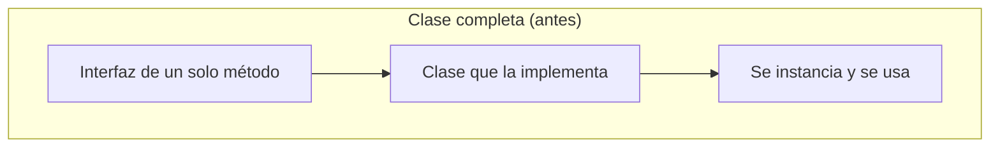
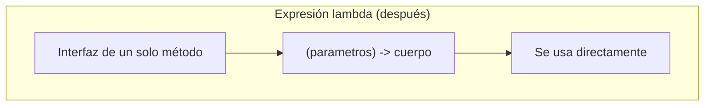
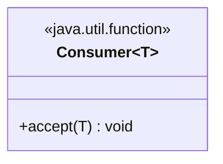
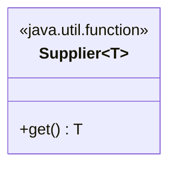
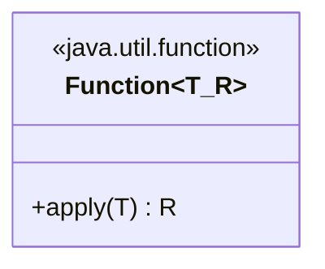
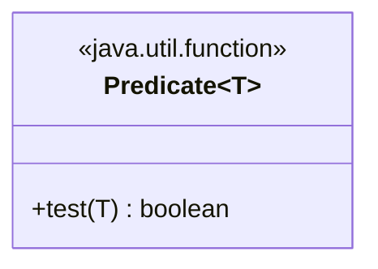
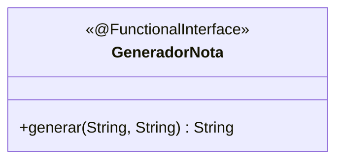

# Módulo 19 — Expresiones Lambda

Curso de Java
---
## 🎯 Objetivos del módulo

- Explicar qué es una expresión lambda y qué problema resuelve.
- Usar `Consumer`, `Supplier`, `Function` y `Predicate` con expresiones lambda.
- Diseñar e implementar interfaces funcionales propias con `@FunctionalInterface`.
---
## 🗺️ Ruta de la sesión

1. Expresiones lambda (Consumer, Supplier, Funciones lambda, Predicate).
2. Expresiones lambda propias.
---
## 🌍 Por qué las expresiones lambda

Implementar una interfaz de un solo método con una clase completa es mucho código para algo simple. Este
módulo cubre cómo hacerlo en una sola línea, con expresiones lambda.
---
## 🧠 ¿Qué es una expresión lambda?

Una **expresión lambda** (`(parámetros) -> cuerpo`) implementa una interfaz funcional (de un único
método abstracto) de forma concisa. No es un mecanismo nuevo: produce el mismo resultado que una clase
que implementa la misma interfaz.
---
## 🗺️ Diagrama: clase completa vs. expresión lambda




---
## 🧵 Consumer

`Consumer<T>` declara `void accept(T t)`: recibe un valor y ejecuta una acción, sin devolver nada.
---
## 🗺️ Diagrama: Consumer


---
## 💻 Consumer — antes

```java
AccionPaciente accion = new ImpresorPaciente();
// clase completa solo para imprimir un paciente
```
---
## 💻 Consumer — después

```java
Consumer<PacienteConsulta> accion = paciente -> System.out.println(paciente.getNombre());
```
---
## 🔍 Consumer — la prueba concreta

Ambas versiones producen exactamente la misma salida para los dos pacientes de la lista; la versión
lambda no necesita declarar ninguna interfaz ni clase nueva.
---
## 🧵 Supplier

`Supplier<T>` declara `T get()`: no recibe ningún parámetro y devuelve un valor de tipo `T`. Es la forma
opuesta a `Consumer<T>`.
---
## 🗺️ Diagrama: Supplier


---
## 💻 Supplier — antes

```java
GeneradorTurno generador = new GeneradorTurnoSecuencial();
// clase completa solo para generar un codigo
```
---
## 💻 Supplier — después

```java
Supplier<String> generador = () -> "TURNO-" + (++contador);
```
---
## 🔍 Supplier — la prueba concreta

Ambas versiones generan exactamente la misma secuencia de códigos (`TURNO-1`, `TURNO-2`, `TURNO-3`).
---
## 🧵 Funciones lambda (Function)

`Function<T, R>` declara `R apply(T t)`: recibe un valor de tipo `T` y devuelve un valor de tipo `R`,
que puede ser distinto.
---
## 🗺️ Diagrama: Function


---
## 💻 Function — antes

```java
Formateador formateador = new FormateadorResumen();
// clase completa solo para transformar un paciente en texto
```
---
## 💻 Function — después

```java
Function<PacienteConsulta, String> formateador = p -> p.getNombre() + " (" + p.getEdad() + " anios)";
```
---
## 🔍 Function — la prueba concreta

Ambas versiones producen exactamente el mismo texto resumido para el mismo paciente.
---
## 🧵 Predicate

`Predicate<T>` declara `boolean test(T t)`: recibe un valor y evalúa una condición, devolviendo siempre
un `boolean`.
---
## 🗺️ Diagrama: Predicate


---
## 💻 Predicate — antes

```java
Condicion condicion = new MayorDeEdad();
// clase completa solo para evaluar una condicion
```
---
## 💻 Predicate — después

```java
Predicate<PacienteConsulta> condicion = paciente -> paciente.getEdad() >= 40;
```
---
## 🔍 Predicate — la prueba concreta

Ambas versiones filtran exactamente el mismo paciente de la lista.
---
## 🧵 Expresiones lambda propias

Cuando un caso no encaja en ninguna de las cuatro interfaces estándar (por ejemplo, recibe dos
parámetros de tipos distintos), se diseña una interfaz funcional propia, anotada
`@FunctionalInterface`.
---
## 🗺️ Diagrama: interfaz propia


---
## 💻 Interfaz propia — antes

```java
GeneradorNota generador = new GeneradorNotaSimple();
// clase completa para combinar nombre y diagnostico
```
---
## 💻 Interfaz propia — después

```java
@FunctionalInterface
public interface GeneradorNota {
    String generar(String nombrePaciente, String diagnostico);
}
```

```java
// dentro de Demo
GeneradorNota generador = (nombrePaciente, diagnostico) -> "Nota: " + nombrePaciente + " presenta " + diagnostico + ".";
```
---
## ⚠️ El error real de @FunctionalInterface

Si la interfaz declara un segundo método abstracto, el compilador la rechaza:

```text
error: Unexpected @FunctionalInterface annotation
  multiple non-overriding abstract methods found in interface GeneradorNotaInvalida
```
---
## ⚠️ Errores frecuentes de este módulo

- Declarar una interfaz propia para un caso que ya cubre una interfaz estándar.
- Confundir `Consumer` (no devuelve nada) con `Function` (transforma y devuelve).
- Confundir `Predicate` (siempre `boolean`) con `Function<T, Boolean>`.
- Agregar un segundo método abstracto a una interfaz ya anotada `@FunctionalInterface`.
---
## 📋 Resumen de las interfaces funcionales

| Interfaz | Recibe | Devuelve | Cuándo usarla |
|---|---|---|---|
| `Consumer<T>` | Un valor | Nada | Ejecutar una acción |
| `Supplier<T>` | Nada | Un valor | Proveer un valor bajo demanda |
| `Function<T, R>` | Un valor | Otro valor | Transformar un valor |
| `Predicate<T>` | Un valor | `boolean` | Evaluar una condición |
| Propia | Lo que necesites | Lo que necesites | Ninguna estándar encaja |
---
## 🛠️ Taller: MediSalud

**Taller 01** (Sistema de Notificaciones): usa las cuatro interfaces estándar y una interfaz propia,
cada una con una responsabilidad clara.
---
## 🧪 Ejercicios: Biblioteca Universitaria

Un ejercicio Básico (identificar la simplificación posible) y uno Intermedio (aplicar la interfaz
correcta) por cada uno de los cinco sub-temas técnicos, con la Biblioteca Universitaria como dominio.
---
## 🔴🏆 Avanzado y Desafío: Biblioteca Universitaria

**Avanzado 01**: corregir un diseño con dos sub-temas ausentes (Function + Predicate). **Desafío 01**:
sin scaffold, combinar al menos dos interfaces funcionales para un problema nuevo.
---
## ❓ Quiz 01

7 preguntas en formato entrevista técnica: una por cada resultado de aprendizaje, con la última
integradora sobre cómo elegir la interfaz funcional adecuada.
---
## 📚 Repaso: la pregunta clave de cada interfaz

- **Consumer**: ¿solo necesito ejecutar una acción, sin devolver nada?
- **Supplier**: ¿necesito un valor, sin recibir ningún parámetro?
- **Function**: ¿necesito transformar un valor en otro?
- **Predicate**: ¿necesito evaluar una condición verdadero/falso?
- **Propia**: ¿ninguna de las anteriores encaja en la forma del problema?
---
## ✅ Checklist de cierre

- Puedo explicar qué es una expresión lambda y qué problema resuelve.
- Puedo usar `Consumer`, `Supplier`, `Function` y `Predicate` con expresiones lambda.
- Puedo diseñar una interfaz funcional propia cuando ninguna estándar encaja.
- Completé el taller, los ejercicios Básico e Intermedio de los cinco sub-temas, y el Quiz 01.
---
## 🎓 Cierre

Una expresión lambda no es magia: es la forma más concisa de implementar una interfaz de un solo
método. Elegir la interfaz correcta (`Consumer`, `Supplier`, `Function`, `Predicate`, o una propia) es lo
que hace el código expresivo y fácil de leer.
