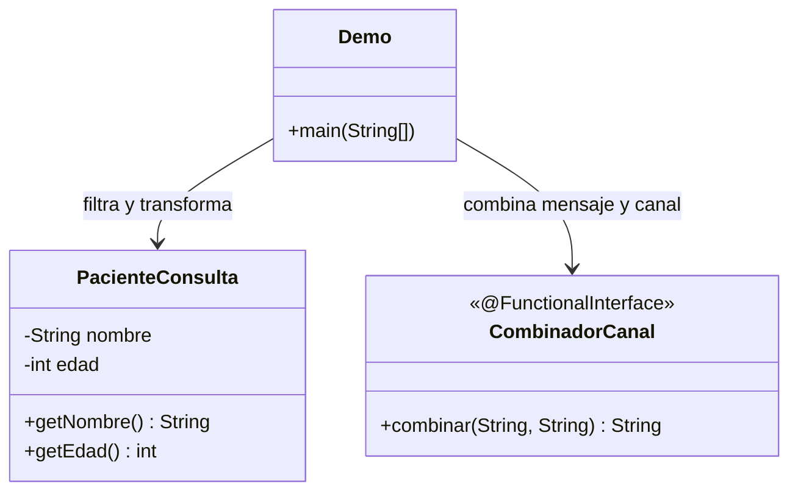

# 🔑 Solución del Taller 01 — Sistema de Notificaciones de MediSalud con Expresiones Lambda

> Material docente, no enlazar desde la audiencia estudiante.

## 🗺️ Diagrama de clases



## 🌳 Árbol de archivos

```text
NotificacionesMediSalud/
└── com/medisalud/
    ├── PacienteConsulta.java
    ├── CombinadorCanal.java
    └── Demo.java
```

## 💻 Código completo

```java
package com.medisalud;

public class PacienteConsulta {
    private final String nombre;
    private final int edad;

    public PacienteConsulta(String nombre, int edad) {
        this.nombre = nombre;
        this.edad = edad;
    }

    public String getNombre() {
        return nombre;
    }

    public int getEdad() {
        return edad;
    }
}
```

```java
package com.medisalud;

@FunctionalInterface
public interface CombinadorCanal {
    String combinar(String mensaje, String canal);
}
```

```java
package com.medisalud;

import java.util.ArrayList;
import java.util.List;
import java.util.function.Consumer;
import java.util.function.Function;
import java.util.function.Predicate;
import java.util.function.Supplier;

public class Demo {
    private static int contador = 0;

    public static void main(String[] args) {
        List<PacienteConsulta> pacientes = new ArrayList<>();
        pacientes.add(new PacienteConsulta("Ana Torres", 65));
        pacientes.add(new PacienteConsulta("Luis Rios", 34));

        Predicate<PacienteConsulta> elegiblePorEdad = paciente -> paciente.getEdad() >= 60;
        Function<PacienteConsulta, String> generarMensaje =
                paciente -> "Recordatorio de control para " + paciente.getNombre();
        Supplier<String> generarId = () -> "NOTIF-" + (++contador);
        CombinadorCanal combinar = (mensaje, canal) -> "[" + canal + "] " + mensaje;
        Consumer<String> enviar = texto -> System.out.println("Enviando: " + texto);

        for (PacienteConsulta paciente : pacientes) {
            if (elegiblePorEdad.test(paciente)) {
                String id = generarId.get();
                String mensaje = generarMensaje.apply(paciente);
                String textoFinal = combinar.combinar(mensaje, "email");
                enviar.accept(id + " - " + textoFinal);
            }
        }
    }
}
```

## ✅ Salida real del caso integrador

```text
Enviando: NOTIF-1 - [email] Recordatorio de control para Ana Torres
```

## ⚠️ Errores comunes

- **Usar `Function<T, Boolean>` en vez de `Predicate<T>`**: funciona, pero comunica peor la intención de
  evaluar una condición.
- **Declarar una interfaz propia para un caso que ya cubre una interfaz estándar**: revisar primero si
  `Consumer`/`Supplier`/`Function`/`Predicate` ya resuelve el caso, antes de diseñar una propia.
- **Olvidar `@FunctionalInterface` en una interfaz propia con un solo método**: sigue funcionando, pero
  pierde la verificación temprana del compilador si en el futuro se le agrega un segundo método por
  error.
- **No filtrar antes de notificar**: enviar la notificación a todos los pacientes sin aplicar el
  `Predicate` primero, notificando a quienes no correspondía.
