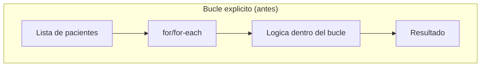
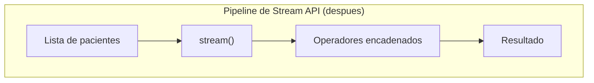

# 💡 Ejemplo 01 — ¿Qué es Stream API?

## 🌍 Contexto

MediSalud recorre todas sus listas de pacientes con bucles `for`/`for-each`, como en todos los módulos
anteriores. Muchas veces esa lógica sigue el mismo patrón: recorrer, transformar o filtrar, y hacer algo
con el resultado — código repetitivo que se repite en cada lugar donde hace falta procesar una lista.

## 🗺️ Diagrama

*Arriba: procesar una colección con un bucle explícito mezcla el recorrido con la lógica de negocio.
Abajo: un pipeline de Stream API separa la fuente, los operadores y el resultado en pasos encadenados.*

## 🧭 Explicación paso a paso

1. Un **Stream** es una secuencia de elementos sobre la que se pueden encadenar operaciones (transformar,
   filtrar, verificar condiciones), sin escribir el bucle explícito que las recorre.
2. **Características de un Stream** (punto 1.1 del temario):
   - **No almacena datos**: un stream no es una estructura de datos como una `List`; solo describe una
     secuencia de operaciones sobre una fuente de datos ya existente.
   - **No modifica su fuente**: aplicar operadores sobre un stream nunca cambia la `List`/arreglo/
     colección original.
   - **Es de un solo uso**: un stream solo puede recorrerse una vez; intentar reutilizarlo produce un
     error real (visto en el Ejemplo 07).
   - **Puede evaluarse de forma perezosa**: los operadores encadenados no se ejecutan hasta que hace
     falta un resultado concreto.
3. Este módulo cubre cuatro formas de crear un stream, cuatro operadores centrales (`map`, `filter`,
   `anyMatch`, `flatMap`), y cómo convertir entre una `List` y un `Stream` en ambas direcciones — todo
   apoyado en las expresiones lambda e interfaces funcionales del Módulo 19.

## ✅ Resultado esperado

Un programa de MediSalud que filtra pacientes mayores de cierta edad y transforma sus datos, escrito
primero con bucles `for` explícitos, y después con un pipeline de Stream API: ambas versiones producen
exactamente el mismo resultado, pero la segunda separa claramente la fuente, la transformación y el
resultado final.

## ❓ Preguntas de repaso

**1. [Selección]** ¿Cuál de las siguientes NO es una característica de un `Stream`?

- A. No almacena datos por sí mismo.
- B. No modifica su fuente original.
- C. Puede recorrerse las veces que haga falta, igual que una `List`.
- D. Puede evaluarse de forma perezosa.

🔑 Ver respuesta

**Respuesta correcta: C.** Un stream es de un solo uso: intentar recorrerlo una segunda vez produce un
error real (`IllegalStateException`), a diferencia de una `List`, que puede recorrerse tantas veces como
haga falta.

**2. [Selección múltiple]** ¿Cuáles de las siguientes afirmaciones sobre Stream API son verdaderas?

- A. Un stream describe una secuencia de operaciones sobre una fuente de datos existente.
- B. Aplicar operadores sobre un stream modifica la lista original de la que se creó.
- C. Un pipeline de Stream API puede reemplazar un bucle `for` con lógica de transformación o filtrado.
- D. Los operadores de un stream pueden evaluarse de forma perezosa.

🔑 Ver respuesta

**Respuestas correctas: A, C y D.** B es falsa: un stream nunca modifica su fuente original; produce un
resultado nuevo sin alterar la lista, el arreglo o la colección de la que se creó.

**3. [Abierta]** Un compañero dice: "un Stream es básicamente lo mismo que una List, solo que con otro
nombre". ¿Estás de acuerdo? Justifica tu respuesta.

🔑 Ver respuesta

No. Una `List` almacena datos y puede recorrerse cuantas veces haga falta. Un `Stream` no almacena
datos: describe una secuencia de operaciones sobre una fuente ya existente, y solo puede recorrerse una
vez. Son conceptos relacionados pero distintos.

