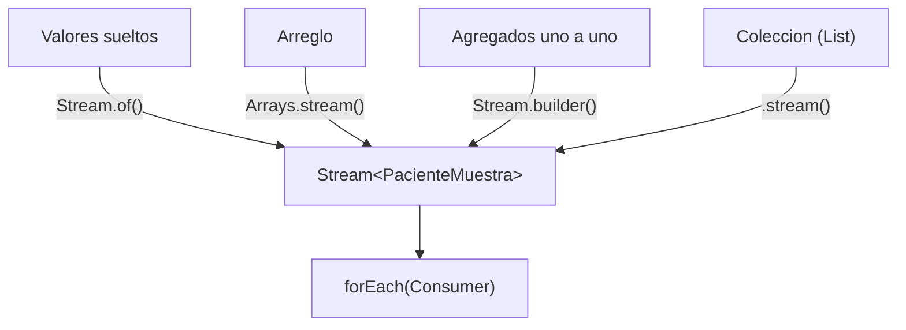

# 💡 Ejemplo 02 — Cómo crear un Stream

## 🌍 Contexto

MediSalud tiene datos de pacientes representados de distintas formas: algunos como valores sueltos, otros
en un arreglo, otros agregados uno por uno, y otros ya en una lista. Hoy cada fuente se recorre con su
propio bucle `for`/`for-each`.

**Qué busca demostrar este ejemplo**: las cuatro formas de crear un `Stream` (`Stream.of()`, a partir de
un arreglo, `Stream.<T>builder()`, y a partir de una colección), cada una produciendo el mismo resultado
que recorrer su fuente con un bucle explícito.

## 🏥 Caso de estudio

MediSalud crea un stream de pacientes desde cuatro fuentes distintas y los recorre con `forEach`.

## 🗺️ Diagrama



## 🌳 Árbol de archivos — antes

```text
creacion-antes/
└── com/medisalud/
    ├── PacienteMuestra.java
    └── Demo.java
```

## 💻 Archivo: PacienteMuestra.java

```java
package com.medisalud;

public class PacienteMuestra {
    private final String nombre;

    public PacienteMuestra(String nombre) {
        this.nombre = nombre;
    }

    public String getNombre() {
        return nombre;
    }
}
```

## 💻 Archivo: Demo.java

```java
package com.medisalud;

import java.util.ArrayList;
import java.util.List;

public class Demo {
    public static void main(String[] args) {
        PacienteMuestra[] arregloPacientes = {
            new PacienteMuestra("Ana Torres"),
            new PacienteMuestra("Luis Rios")
        };

        System.out.println("Pacientes del arreglo (bucle for):");
        for (int i = 0; i < arregloPacientes.length; i++) {
            System.out.println("- " + arregloPacientes[i].getNombre());
        }

        List<PacienteMuestra> listaPacientes = new ArrayList<>();
        listaPacientes.add(new PacienteMuestra("Marta Diaz"));
        listaPacientes.add(new PacienteMuestra("Carlos Mena"));

        System.out.println("Pacientes de la lista (bucle for-each):");
        for (PacienteMuestra paciente : listaPacientes) {
            System.out.println("- " + paciente.getNombre());
        }
    }
}
```

## ✅ Resultado esperado — antes

```text
Pacientes del arreglo (bucle for):
- Ana Torres
- Luis Rios
Pacientes de la lista (bucle for-each):
- Marta Diaz
- Carlos Mena
```

## 🌳 Árbol de archivos — después

```text
creacion-despues/
├── PacienteMuestra.java        (sin cambios)
└── Demo.java                   (cambió)
```

## 💻 Archivo: PacienteMuestra.java

```java
package com.medisalud;

public class PacienteMuestra {
    private final String nombre;

    public PacienteMuestra(String nombre) {
        this.nombre = nombre;
    }

    public String getNombre() {
        return nombre;
    }
}
```

## 💻 Archivo: Demo.java — cambió

```java
package com.medisalud;

import java.util.ArrayList;
import java.util.Arrays;
import java.util.List;
import java.util.function.Consumer;
import java.util.stream.Stream;

public class Demo {
    public static void main(String[] args) {
        PacienteMuestra ana = new PacienteMuestra("Ana Torres");
        PacienteMuestra luis = new PacienteMuestra("Luis Rios");
        PacienteMuestra[] arregloPacientes = {ana, luis};

        Consumer<PacienteMuestra> imprimir = paciente -> System.out.println("- " + paciente.getNombre());

        System.out.println("Pacientes con Stream.of() (valores sueltos):");
        Stream<PacienteMuestra> streamDeValores = Stream.of(ana, luis);
        streamDeValores.forEach(imprimir);

        System.out.println("Pacientes a partir de un arreglo:");
        Stream<PacienteMuestra> streamDeArreglo = Arrays.stream(arregloPacientes);
        streamDeArreglo.forEach(imprimir);

        System.out.println("Pacientes con Stream.<PacienteMuestra>builder():");
        Stream<PacienteMuestra> streamDeBuilder = Stream.<PacienteMuestra>builder()
                .add(new PacienteMuestra("Marta Diaz"))
                .add(new PacienteMuestra("Carlos Mena"))
                .build();
        streamDeBuilder.forEach(imprimir);

        List<PacienteMuestra> listaPacientes = new ArrayList<>();
        listaPacientes.add(new PacienteMuestra("Marta Diaz"));
        listaPacientes.add(new PacienteMuestra("Carlos Mena"));

        System.out.println("Pacientes a partir de una coleccion:");
        Stream<PacienteMuestra> streamDeColeccion = listaPacientes.stream();
        streamDeColeccion.forEach(imprimir);
    }
}
```

## ✅ Resultado esperado — después

```text
Pacientes con Stream.of() (valores sueltos):
- Ana Torres
- Luis Rios
Pacientes a partir de un arreglo:
- Ana Torres
- Luis Rios
Pacientes con Stream.<PacienteMuestra>builder():
- Marta Diaz
- Carlos Mena
Pacientes a partir de una coleccion:
- Marta Diaz
- Carlos Mena
```

## 🔍 Comparación: la prueba concreta

Las cuatro formas de creación producen exactamente los mismos pacientes que sus bucles equivalentes: los
del arreglo (`Stream.of()` y `Arrays.stream()`) coinciden con el bucle `for` original; los de la
colección (`Stream.builder()` y `.stream()`) coinciden con el bucle `for-each` original — verificable
ejecutando ambas versiones.

## 🔍 Análisis: errores frecuentes

El error más frecuente es confundir `Stream.of()` (recibe valores sueltos o un arreglo tratado como
varargs) con `Arrays.stream()` (siempre a partir de un arreglo explícito). Ambos pueden usarse con un
arreglo, pero `Arrays.stream()` es la forma más clara de expresar la intención "quiero un stream a partir
de este arreglo".

## ❓ Preguntas de repaso

**1. [Selección]** ¿Qué método se usa para crear un `Stream` a partir de valores sueltos?

- A. `Arrays.stream()`
- B. `Stream.of()`
- C. `Stream.builder()`
- D. `.stream()`

<details>
<summary>🔑 Ver respuesta</summary>

**Respuesta correcta: B.** `Stream.of(valor1, valor2, ...)` crea un stream directamente a partir de
valores sueltos.

</details>

**2. [Selección múltiple]** Sobre este ejemplo, ¿cuáles afirmaciones son verdaderas?

- A. `Arrays.stream(arreglo)` crea un stream a partir de un arreglo existente.
- B. `Stream.<T>builder()` permite agregar elementos uno por uno antes de construir el stream con
  `.build()`.
- C. Toda colección que implementa `Collection` tiene un método `.stream()`.
- D. Las cuatro formas de creación producen tipos de streams distintos entre sí, no intercambiables.

<details>
<summary>🔑 Ver respuesta</summary>

**Respuestas correctas: A, B y C.** D es falsa: las cuatro formas producen el mismo tipo,
`Stream<T>`, solo cambia la fuente de datos.

</details>

**3. [Abierta]** Un compañero dice: "si ya tengo una `List`, no tiene sentido aprender las otras tres
formas de crear un stream". ¿Estás de acuerdo? Justifica tu respuesta.

<details>
<summary>🔑 Ver respuesta</summary>

No siempre los datos ya están en una `List`. A veces vienen como valores sueltos, como un arreglo (por
ejemplo, el resultado de un método que devuelve `T[]`), o se arman elemento por elemento en tiempo de
ejecución (`Stream.builder()`). Conocer las cuatro formas permite elegir la más directa según la fuente
real de los datos, sin tener que convertir todo a `List` primero.

</details>
