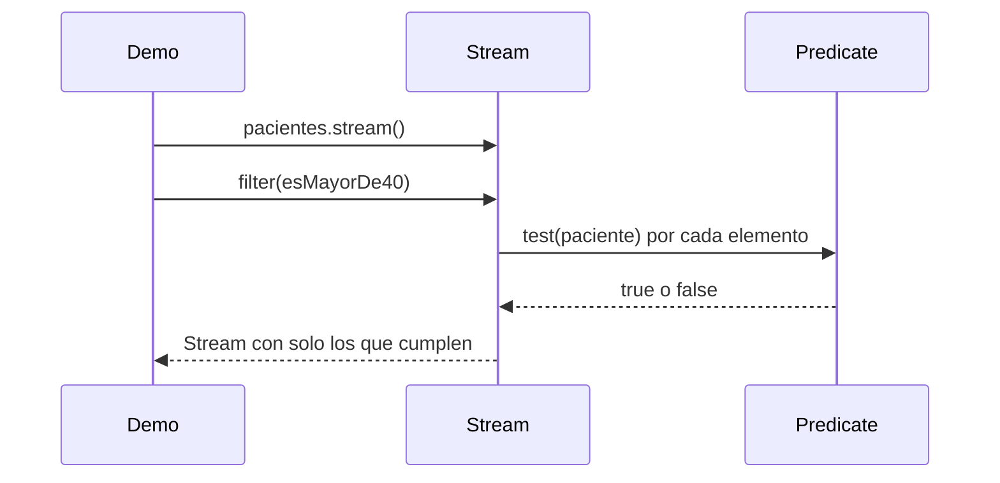

# 💡 Ejemplo 04 — Operador filter

## 🌍 Contexto

MediSalud necesita seleccionar, de una lista de pacientes, solo los mayores de cierta edad. Hoy esa
selección está implementada con un bucle `for` y un `if` que arma una nueva lista a mano.

**Qué busca demostrar este ejemplo**: cómo usar el operador `filter` con un `Predicate` (Módulo 19) para
seleccionar los elementos de un stream que cumplen una condición.

## 🏥 Caso de estudio

MediSalud selecciona los pacientes mayores de 40 años de una lista.

## 🗺️ Diagrama



## 🌳 Árbol de archivos — antes

```text
filter-antes/
└── com/medisalud/
    ├── PacienteMuestra.java
    └── Demo.java
```

## 💻 Archivo: PacienteMuestra.java

```java
package com.medisalud;

public class PacienteMuestra {
    private final String nombre;
    private final int edad;

    public PacienteMuestra(String nombre, int edad) {
        this.nombre = nombre;
        this.edad = edad;
    }

    public String getNombre() {
        return nombre;
    }

    public int getEdad() {
        return edad;
    }
}
```

## 💻 Archivo: Demo.java

```java
package com.medisalud;

import java.util.ArrayList;
import java.util.List;

public class Demo {
    public static void main(String[] args) {
        List<PacienteMuestra> pacientes = new ArrayList<>();
        pacientes.add(new PacienteMuestra("Ana Torres", 34));
        pacientes.add(new PacienteMuestra("Luis Rios", 45));
        pacientes.add(new PacienteMuestra("Marta Diaz", 52));

        List<PacienteMuestra> mayores = new ArrayList<>();
        for (PacienteMuestra paciente : pacientes) {
            if (paciente.getEdad() >= 40) {
                mayores.add(paciente);
            }
        }

        System.out.println("Pacientes mayores de 40:");
        for (PacienteMuestra paciente : mayores) {
            System.out.println("- " + paciente.getNombre());
        }
    }
}
```

## ✅ Resultado esperado — antes

```text
Pacientes mayores de 40:
- Luis Rios
- Marta Diaz
```

## 🌳 Árbol de archivos — después

```text
filter-despues/
├── PacienteMuestra.java        (sin cambios)
└── Demo.java                   (cambió)
```

## 💻 Archivo: PacienteMuestra.java

```java
package com.medisalud;

public class PacienteMuestra {
    private final String nombre;
    private final int edad;

    public PacienteMuestra(String nombre, int edad) {
        this.nombre = nombre;
        this.edad = edad;
    }

    public String getNombre() {
        return nombre;
    }

    public int getEdad() {
        return edad;
    }
}
```

## 💻 Archivo: Demo.java — cambió

```java
package com.medisalud;

import java.util.ArrayList;
import java.util.List;
import java.util.function.Predicate;
import java.util.stream.Stream;

public class Demo {
    public static void main(String[] args) {
        List<PacienteMuestra> pacientes = new ArrayList<>();
        pacientes.add(new PacienteMuestra("Ana Torres", 34));
        pacientes.add(new PacienteMuestra("Luis Rios", 45));
        pacientes.add(new PacienteMuestra("Marta Diaz", 52));

        Predicate<PacienteMuestra> esMayorDe40 = paciente -> paciente.getEdad() >= 40;

        System.out.println("Pacientes mayores de 40:");
        Stream<PacienteMuestra> mayores = pacientes.stream().filter(esMayorDe40);
        mayores.forEach(paciente -> System.out.println("- " + paciente.getNombre()));
    }
}
```

## ✅ Resultado esperado — después

```text
Pacientes mayores de 40:
- Luis Rios
- Marta Diaz
```

## 🔍 Comparación: la prueba concreta

Ambas versiones seleccionan exactamente los mismos dos pacientes (mayores de 40), verificable ejecutando
las dos. La versión "antes" arma una nueva `List` a mano dentro del bucle. La versión "después" usa
`filter` con un `Predicate<PacienteMuestra>`, que selecciona los elementos del stream sin declarar una
lista intermedia.

## 🔍 Análisis: errores frecuentes

El error más frecuente es confundir `filter` con `map`: `filter` puede **reducir** la cantidad de
elementos (solo pasan los que cumplen la condición); `map` siempre mantiene la misma cantidad,
transformando cada uno.

## ❓ Preguntas de repaso

**1. [Selección]** ¿Qué hace el operador `filter` sobre un stream?

- A. Transforma cada elemento en otro valor.
- B. Selecciona los elementos que cumplen una condición, pudiendo reducir la cantidad de elementos.
- C. Verifica si al menos un elemento cumple una condición.
- D. Aplana una estructura de streams anidados.

<details>
<summary>🔑 Ver respuesta</summary>

**Respuesta correcta: B.** `filter` selecciona, con un `Predicate`, los elementos que cumplen la
condición; el resultado puede tener menos elementos que el stream original.

</details>

**2. [Selección múltiple]** Sobre este ejemplo, ¿cuáles afirmaciones son verdaderas?

- A. `filter` recibe un `Predicate<T>` como argumento.
- B. El stream resultante de `filter` puede tener menos elementos que el original.
- C. `filter` siempre mantiene la misma cantidad de elementos que el stream original.
- D. Ambas versiones (antes y después) seleccionan exactamente los mismos pacientes.

<details>
<summary>🔑 Ver respuesta</summary>

**Respuestas correctas: A, B y D.** C es falsa: eso describe a `map`, no a `filter`.

</details>

**3. [Abierta]** Un compañero dice: "puedo usar `filter` para transformar el nombre de cada paciente a
mayúsculas". ¿Estás de acuerdo? Justifica tu respuesta.

<details>
<summary>🔑 Ver respuesta</summary>

No. `filter` solo decide qué elementos pasan al stream resultante, según una condición booleana; no
transforma su contenido. Para transformar cada elemento, la herramienta correcta es `map` (Ejemplo 03).

</details>
