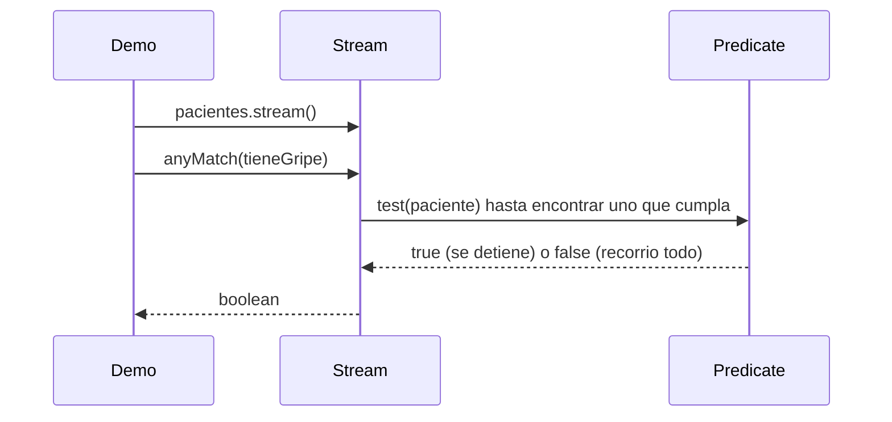

# 💡 Ejemplo 05 — Operador anyMatch

## 🌍 Contexto

MediSalud necesita verificar si al menos un paciente de una lista tiene cierto diagnóstico. Hoy esa
verificación está implementada con un bucle `for`, una bandera booleana, y un `break` manual.

**Qué busca demostrar este ejemplo**: cómo usar el operador `anyMatch` con un `Predicate` (Módulo 19)
para verificar si al menos un elemento de un stream cumple una condición.

## 🏥 Caso de estudio

MediSalud verifica si existe al menos un paciente con "Gripe", y si existe al menos uno con "Migrana".

## 🗺️ Diagrama



## 🌳 Árbol de archivos — antes

```text
anymatch-antes/
└── com/medisalud/
    ├── PacienteMuestra.java
    └── Demo.java
```

## 💻 Archivo: PacienteMuestra.java

```java
package com.medisalud;

public class PacienteMuestra {
    private final String nombre;
    private final String diagnostico;

    public PacienteMuestra(String nombre, String diagnostico) {
        this.nombre = nombre;
        this.diagnostico = diagnostico;
    }

    public String getNombre() {
        return nombre;
    }

    public String getDiagnostico() {
        return diagnostico;
    }
}
```

## 💻 Archivo: Demo.java

```java
package com.medisalud;

import java.util.ArrayList;
import java.util.List;

public class Demo {
    public static void main(String[] args) {
        List<PacienteMuestra> pacientes = new ArrayList<>();
        pacientes.add(new PacienteMuestra("Ana Torres", "Gripe"));
        pacientes.add(new PacienteMuestra("Luis Rios", "Hipertension"));

        boolean hayGripe = false;
        for (PacienteMuestra paciente : pacientes) {
            if (paciente.getDiagnostico().equals("Gripe")) {
                hayGripe = true;
                break;
            }
        }
        System.out.println("¿Hay algun paciente con Gripe? " + hayGripe);

        boolean hayMigrana = false;
        for (PacienteMuestra paciente : pacientes) {
            if (paciente.getDiagnostico().equals("Migrana")) {
                hayMigrana = true;
                break;
            }
        }
        System.out.println("¿Hay algun paciente con Migrana? " + hayMigrana);
    }
}
```

## ✅ Resultado esperado — antes

```text
¿Hay algun paciente con Gripe? true
¿Hay algun paciente con Migrana? false
```

## 🌳 Árbol de archivos — después

```text
anymatch-despues/
├── PacienteMuestra.java        (sin cambios)
└── Demo.java                   (cambió)
```

## 💻 Archivo: PacienteMuestra.java

```java
package com.medisalud;

public class PacienteMuestra {
    private final String nombre;
    private final String diagnostico;

    public PacienteMuestra(String nombre, String diagnostico) {
        this.nombre = nombre;
        this.diagnostico = diagnostico;
    }

    public String getNombre() {
        return nombre;
    }

    public String getDiagnostico() {
        return diagnostico;
    }
}
```

## 💻 Archivo: Demo.java — cambió

```java
package com.medisalud;

import java.util.ArrayList;
import java.util.List;
import java.util.function.Predicate;

public class Demo {
    public static void main(String[] args) {
        List<PacienteMuestra> pacientes = new ArrayList<>();
        pacientes.add(new PacienteMuestra("Ana Torres", "Gripe"));
        pacientes.add(new PacienteMuestra("Luis Rios", "Hipertension"));

        Predicate<PacienteMuestra> tieneGripe = paciente -> paciente.getDiagnostico().equals("Gripe");
        boolean hayGripe = pacientes.stream().anyMatch(tieneGripe);
        System.out.println("¿Hay algun paciente con Gripe? " + hayGripe);

        Predicate<PacienteMuestra> tieneMigrana = paciente -> paciente.getDiagnostico().equals("Migrana");
        boolean hayMigrana = pacientes.stream().anyMatch(tieneMigrana);
        System.out.println("¿Hay algun paciente con Migrana? " + hayMigrana);
    }
}
```

## ✅ Resultado esperado — después

```text
¿Hay algun paciente con Gripe? true
¿Hay algun paciente con Migrana? false
```

## 🔍 Comparación: la prueba concreta

Ambas versiones dan exactamente el mismo resultado para los dos casos: `true` para "Gripe" (existe un
paciente con ese diagnóstico) y `false` para "Migrana" (no existe ninguno), verificable ejecutando las
dos. La versión "antes" necesita una bandera booleana y un `break` manual. La versión "después" usa
`anyMatch` con un `Predicate<PacienteMuestra>`, que devuelve el resultado directamente.

## 🔍 Análisis: errores frecuentes

El error más frecuente es confundir `anyMatch` (operación **terminal**, devuelve un `boolean`) con
`filter` (operación **intermedia**, devuelve un nuevo `Stream`): `anyMatch` no se puede seguir
encadenando con más operadores después, porque ya consumió el stream.

## ❓ Preguntas de repaso

**1. [Selección]** ¿Qué devuelve el operador `anyMatch`?

- A. Un nuevo `Stream` con los elementos que cumplen la condición.
- B. Un `boolean`: si al menos un elemento del stream cumple la condición.
- C. La cantidad de elementos que cumplen la condición.
- D. El primer elemento que cumple la condición.

<details>
<summary>🔑 Ver respuesta</summary>

**Respuesta correcta: B.** `anyMatch` devuelve `true` si al menos un elemento cumple el `Predicate`
recibido, `false` si ninguno lo cumple.

</details>

**2. [Selección múltiple]** Sobre este ejemplo, ¿cuáles afirmaciones son verdaderas?

- A. `anyMatch` recibe un `Predicate<T>` como argumento.
- B. `anyMatch` es una operación terminal: consume el stream y devuelve un resultado final.
- C. Después de `anyMatch`, se puede seguir encadenando `map` sobre el mismo stream.
- D. Con el valor "Migrana", el resultado real es `false`.

<details>
<summary>🔑 Ver respuesta</summary>

**Respuestas correctas: A, B y D.** C es falsa: `anyMatch` consume el stream (es terminal); intentar
reutilizarlo después produce el error real del Ejemplo 07.

</details>

**3. [Abierta]** Un compañero dice: "puedo usar `anyMatch` para quedarme con la lista de todos los
pacientes que tienen Gripe". ¿Estás de acuerdo? Justifica tu respuesta.

<details>
<summary>🔑 Ver respuesta</summary>

No. `anyMatch` solo devuelve un `boolean` (si existe al menos uno), no una lista de los que cumplen la
condición. Para obtener esa lista, la herramienta correcta es `filter` (Ejemplo 04), seguido de la
conversión a `List` (Ejemplo 07) si hace falta un resultado concreto.

</details>
