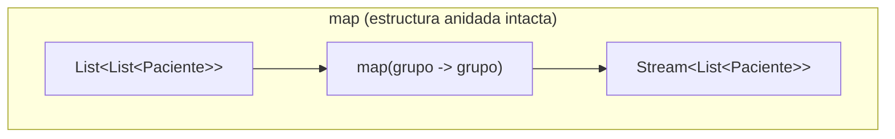
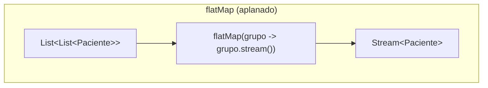

# 💡 Ejemplo 06 — Operador flatMap

## 🌍 Contexto

MediSalud organiza sus pacientes por consultorio: cada consultorio tiene su propia lista de pacientes.
Para procesar a todos los pacientes juntos (sin importar el consultorio), hoy hace falta un bucle `for`
anidado que recorre cada consultorio y, dentro, cada paciente.

**Qué busca demostrar este ejemplo**: cómo usar el operador `flatMap` para aplanar una estructura de
colecciones anidadas en un único stream, contrastado explícitamente contra `map` sobre el mismo caso.

## 🏥 Caso de estudio

MediSalud aplana una lista de consultorios (cada uno con su lista de pacientes) en un único stream de
pacientes.

## 🗺️ Diagrama





## 🌳 Árbol de archivos — antes

```text
flatmap-antes/
└── com/medisalud/
    ├── PacienteMuestra.java
    └── Demo.java
```

## 💻 Archivo: PacienteMuestra.java

```java
package com.medisalud;

public class PacienteMuestra {
    private final String nombre;

    public PacienteMuestra(String nombre) {
        this.nombre = nombre;
    }

    public String getNombre() {
        return nombre;
    }
}
```

## 💻 Archivo: Demo.java

```java
package com.medisalud;

import java.util.ArrayList;
import java.util.List;

public class Demo {
    public static void main(String[] args) {
        List<List<PacienteMuestra>> consultorios = new ArrayList<>();

        List<PacienteMuestra> consultorio1 = new ArrayList<>();
        consultorio1.add(new PacienteMuestra("Ana Torres"));
        consultorio1.add(new PacienteMuestra("Luis Rios"));
        consultorios.add(consultorio1);

        List<PacienteMuestra> consultorio2 = new ArrayList<>();
        consultorio2.add(new PacienteMuestra("Marta Diaz"));
        consultorios.add(consultorio2);

        List<PacienteMuestra> todos = new ArrayList<>();
        for (List<PacienteMuestra> consultorio : consultorios) {
            for (PacienteMuestra paciente : consultorio) {
                todos.add(paciente);
            }
        }

        System.out.println("Total de pacientes en todos los consultorios: " + todos.size());
        for (PacienteMuestra paciente : todos) {
            System.out.println("- " + paciente.getNombre());
        }
    }
}
```

## ✅ Resultado esperado — antes

```text
Total de pacientes en todos los consultorios: 3
- Ana Torres
- Luis Rios
- Marta Diaz
```

## 🌳 Árbol de archivos — después

```text
flatmap-despues/
├── PacienteMuestra.java        (sin cambios)
└── Demo.java                   (cambió)
```

## 💻 Archivo: PacienteMuestra.java

```java
package com.medisalud;

public class PacienteMuestra {
    private final String nombre;

    public PacienteMuestra(String nombre) {
        this.nombre = nombre;
    }

    public String getNombre() {
        return nombre;
    }
}
```

## 💻 Archivo: Demo.java — cambió

```java
package com.medisalud;

import java.util.ArrayList;
import java.util.List;
import java.util.function.Consumer;
import java.util.stream.Stream;

public class Demo {
    public static void main(String[] args) {
        List<List<PacienteMuestra>> consultorios = new ArrayList<>();

        List<PacienteMuestra> consultorio1 = new ArrayList<>();
        consultorio1.add(new PacienteMuestra("Ana Torres"));
        consultorio1.add(new PacienteMuestra("Luis Rios"));
        consultorios.add(consultorio1);

        List<PacienteMuestra> consultorio2 = new ArrayList<>();
        consultorio2.add(new PacienteMuestra("Marta Diaz"));
        consultorios.add(consultorio2);

        System.out.println("Con map (estructura anidada intacta):");
        Consumer<List<PacienteMuestra>> mostrarGrupo =
                grupo -> System.out.println("- Un consultorio con " + grupo.size() + " paciente(s)");
        Stream<List<PacienteMuestra>> streamDeGrupos = consultorios.stream().map(grupo -> grupo);
        streamDeGrupos.forEach(mostrarGrupo);

        System.out.println("Con flatMap (aplanado en un unico stream de pacientes):");
        Consumer<PacienteMuestra> mostrarPaciente = paciente -> System.out.println("- " + paciente.getNombre());
        Stream<PacienteMuestra> streamAplanado = consultorios.stream().flatMap(grupo -> grupo.stream());
        streamAplanado.forEach(mostrarPaciente);
    }
}
```

## ✅ Resultado esperado — después

```text
Con map (estructura anidada intacta):
- Un consultorio con 2 paciente(s)
- Un consultorio con 1 paciente(s)
Con flatMap (aplanado en un unico stream de pacientes):
- Ana Torres
- Luis Rios
- Marta Diaz
```

## 🔍 Comparación: la prueba concreta

La versión "después" contrasta ambos operadores sobre el mismo caso: `map` produce un
`Stream<List<PacienteMuestra>>` — la estructura anidada queda intacta, verificable porque se imprime el
tamaño de cada grupo (`2` y `1` pacientes) en vez de los pacientes individuales. `flatMap` aplana
correctamente en un único `Stream<PacienteMuestra>`, verificable porque imprime cada paciente individual
(`3` en total) — exactamente el mismo resultado que el bucle `for` anidado de la versión "antes".

## 🔍 Análisis: errores frecuentes

El error más frecuente es usar `map` en vez de `flatMap` sobre una estructura anidada: el código compila
igual, pero el resultado sigue teniendo la estructura anidada (un stream de listas), en vez de un único
stream aplanado — un error silencioso si no se verifica la forma real del resultado.

## ❓ Preguntas de repaso

**1. [Selección]** ¿Qué hace el operador `flatMap` sobre un stream de listas?

- A. Transforma cada lista en un `String`.
- B. Aplana las listas anidadas en un único stream de sus elementos.
- C. Selecciona solo las listas que cumplen una condición.
- D. Verifica si al menos una lista cumple una condición.

<details>
<summary>🔑 Ver respuesta</summary>

**Respuesta correcta: B.** `flatMap` combina la transformación de `map` con un aplanado: cada elemento
se transforma en un stream, y todos esos streams se combinan en uno solo.

</details>

**2. [Selección múltiple]** Sobre este ejemplo, ¿cuáles afirmaciones son verdaderas?

- A. `map(grupo -> grupo)` sobre un `List<List<PacienteMuestra>>` produce un
  `Stream<List<PacienteMuestra>>`.
- B. `flatMap(grupo -> grupo.stream())` sobre el mismo caso produce un `Stream<PacienteMuestra>`.
- C. `map` y `flatMap` siempre producen el mismo resultado sobre una estructura anidada.
- D. El resultado de `flatMap` en este ejemplo tiene 3 pacientes, igual que el bucle anidado.

<details>
<summary>🔑 Ver respuesta</summary>

**Respuestas correctas: A, B y D.** C es falsa: es exactamente la diferencia que demuestra este
ejemplo — `map` deja la estructura anidada intacta, `flatMap` la aplana.

</details>

**3. [Abierta]** Un compañero dice: "si mi stream ya no tiene listas anidadas, `flatMap` y `map` son
intercambiables". ¿Estás de acuerdo? Justifica tu respuesta.

<details>
<summary>🔑 Ver respuesta</summary>

No exactamente. Si no hay anidamiento, `map` es la herramienta correcta: `flatMap` espera que la función
devuelva un stream por cada elemento, así que usarlo sobre un caso sin anidamiento obligaría a envolver
cada valor en un stream de un solo elemento, código innecesario. `flatMap` tiene sentido específicamente
cuando cada elemento se transforma en **varios** elementos (o en una colección) que hay que aplanar.

</details>
