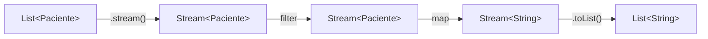

# 💡 Ejemplo 07 — Conversión de List a Stream

## 🌍 Contexto

MediSalud necesita filtrar y transformar su lista de pacientes en una lista de nombres, y además
entender qué pasa si intenta reutilizar un stream que ya procesó.

**Qué busca demostrar este ejemplo**: cómo cerrar el ciclo completo `List → Stream → operadores → List`
con `.stream()` y `.toList()`, y el error real que ocurre al reutilizar un stream ya consumido.

## 🏥 Caso de estudio

MediSalud filtra los pacientes mayores de 40 años y obtiene sus nombres en una nueva `List<String>`.

## 🗺️ Diagrama



## 🌳 Árbol de archivos — antes

```text
conversion-antes/
└── com/medisalud/
    ├── PacienteMuestra.java
    └── Demo.java
```

## 💻 Archivo: PacienteMuestra.java

```java
package com.medisalud;

public class PacienteMuestra {
    private final String nombre;
    private final int edad;

    public PacienteMuestra(String nombre, int edad) {
        this.nombre = nombre;
        this.edad = edad;
    }

    public String getNombre() {
        return nombre;
    }

    public int getEdad() {
        return edad;
    }
}
```

## 💻 Archivo: Demo.java

```java
package com.medisalud;

import java.util.ArrayList;
import java.util.List;

public class Demo {
    public static void main(String[] args) {
        List<PacienteMuestra> pacientes = new ArrayList<>();
        pacientes.add(new PacienteMuestra("Ana Torres", 34));
        pacientes.add(new PacienteMuestra("Luis Rios", 45));
        pacientes.add(new PacienteMuestra("Marta Diaz", 52));

        List<String> nombresMayores = new ArrayList<>();
        for (PacienteMuestra paciente : pacientes) {
            if (paciente.getEdad() >= 40) {
                nombresMayores.add(paciente.getNombre());
            }
        }

        System.out.println("Pacientes mayores de 40:");
        for (String nombre : nombresMayores) {
            System.out.println("- " + nombre);
        }
    }
}
```

## ✅ Resultado esperado — antes

```text
Pacientes mayores de 40:
- Luis Rios
- Marta Diaz
```

## 🌳 Árbol de archivos — después

```text
conversion-despues/
├── PacienteMuestra.java        (sin cambios)
└── Demo.java                   (cambió)
```

## 💻 Archivo: PacienteMuestra.java

```java
package com.medisalud;

public class PacienteMuestra {
    private final String nombre;
    private final int edad;

    public PacienteMuestra(String nombre, int edad) {
        this.nombre = nombre;
        this.edad = edad;
    }

    public String getNombre() {
        return nombre;
    }

    public int getEdad() {
        return edad;
    }
}
```

## 💻 Archivo: Demo.java — cambió

```java
package com.medisalud;

import java.util.ArrayList;
import java.util.List;
import java.util.stream.Stream;

public class Demo {
    public static void main(String[] args) {
        List<PacienteMuestra> pacientes = new ArrayList<>();
        pacientes.add(new PacienteMuestra("Ana Torres", 34));
        pacientes.add(new PacienteMuestra("Luis Rios", 45));
        pacientes.add(new PacienteMuestra("Marta Diaz", 52));

        List<String> nombresMayores = pacientes.stream()
                .filter(paciente -> paciente.getEdad() >= 40)
                .map(paciente -> paciente.getNombre())
                .toList();

        System.out.println("Pacientes mayores de 40:");
        for (String nombre : nombresMayores) {
            System.out.println("- " + nombre);
        }

        System.out.println();
        System.out.println("Intento de reutilizar el mismo stream:");
        Stream<PacienteMuestra> stream = pacientes.stream();
        stream.forEach(paciente -> System.out.println(paciente.getNombre()));
        try {
            stream.forEach(paciente -> System.out.println(paciente.getNombre()));
        } catch (IllegalStateException e) {
            System.out.println("Error real al reutilizar el stream: " + e.getMessage());
        }
    }
}
```

## ✅ Resultado esperado — después

```text
Pacientes mayores de 40:
- Luis Rios
- Marta Diaz

Intento de reutilizar el mismo stream:
Ana Torres
Luis Rios
Marta Diaz
Error real al reutilizar el stream: stream has already been operated upon or closed
```

## 🔍 Comparación: la prueba concreta

Ambas versiones producen exactamente los mismos dos nombres (`Luis Rios`, `Marta Diaz`): la versión
"antes" con un bucle `for` y una `List` acumuladora manual; la versión "después" encadenando
`.filter(...).map(...).toList()` sobre el stream. La versión "después" agrega además una prueba real que
no tiene equivalente en un bucle `for`: crea un `Stream<PacienteMuestra>` en una variable, lo recorre una
vez con éxito, y al intentar recorrerlo una segunda vez sobre la misma variable, produce un error real
capturado con `try`/`catch`: `Error real al reutilizar el stream: stream has already been operated upon
or closed` — el mensaje exacto que lanza la JVM.

## 🔍 Análisis: errores frecuentes

El error más frecuente es guardar un stream en una variable y reutilizarla en más de una operación
terminal (por ejemplo, dos llamadas a `.forEach()` sobre la misma variable). A diferencia de una `List`,
un stream es de un solo uso: la segunda operación siempre lanza `IllegalStateException`, sin importar qué
operación terminal sea.

## ❓ Preguntas de repaso

**1. [Selección]** ¿Qué método convierte un `Stream<T>` en una `List<T>`?

- A. `.list()`
- B. `.collect()`
- C. `.toList()`
- D. `.asList()`

<details>
<summary>🔑 Ver respuesta</summary>

**Respuesta correcta: C.** `.toList()` es una operación terminal que recolecta los elementos del stream
en una `List<T>` nueva.

</details>

---

**2. [Selección múltiple]** Sobre este ejemplo, ¿cuáles afirmaciones son verdaderas?

- A. `pacientes.stream()` crea un `Stream<PacienteMuestra>` a partir de la `List`.
- B. Encadenar `.filter(...).map(...).toList()` cierra el ciclo `List → Stream → List`.
- C. Un `Stream` puede recorrerse tantas veces como haga falta, igual que una `List`.
- D. Llamar dos veces a una operación terminal sobre la misma variable de stream lanza
  `IllegalStateException`.

<details>
<summary>🔑 Ver respuesta</summary>

**Respuestas correctas: A, B y D.** C es falsa: es exactamente lo que demuestra la prueba de este
ejemplo — un stream es de un solo uso.

</details>

---

**3. [Abierta]** ¿Por qué el programa de este ejemplo termina con código `0` a pesar de que ocurre un
`IllegalStateException` real?

<details>
<summary>🔑 Ver respuesta</summary>

Porque el `IllegalStateException` se captura con `try`/`catch`: el programa maneja el error, imprime su
mensaje, y sigue su ejecución con normalidad hasta el final. Un error manejado correctamente no interrumpe
la ejecución del programa.

</details>
