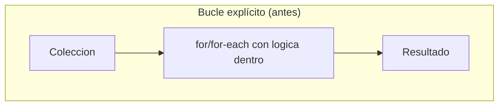
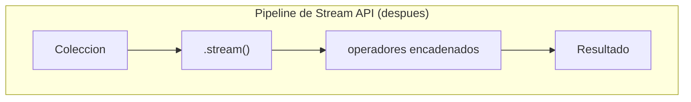
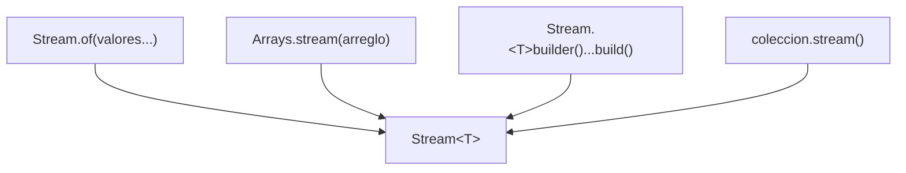
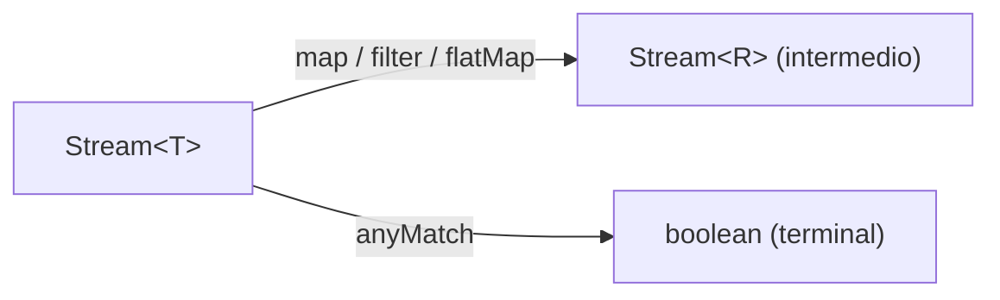
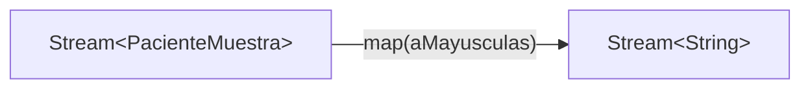
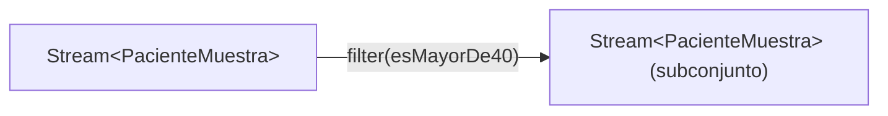
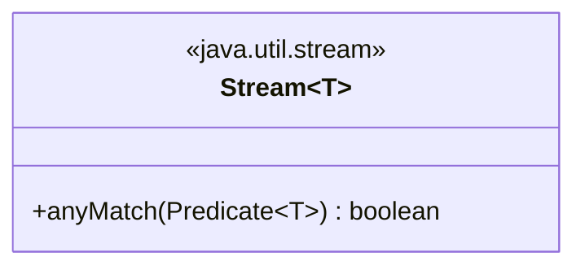
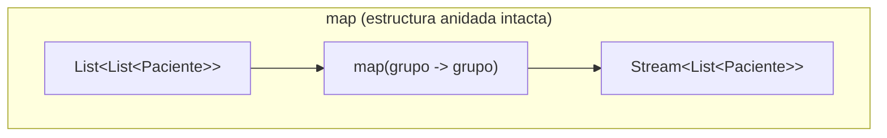
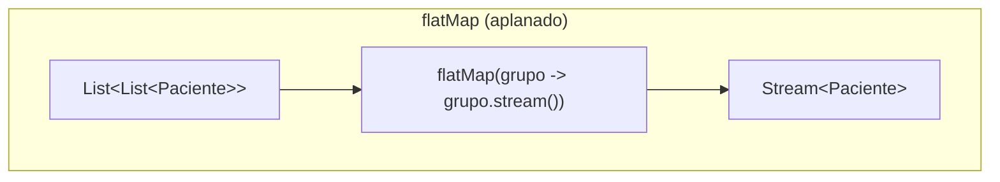
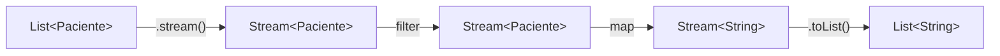

# Módulo 20 — Stream API

Curso de Java
---
## 🎯 Objetivos del módulo

- Explicar qué es un Stream y qué características tiene.
- Crear un `Stream` de cuatro formas distintas.
- Usar los operadores `map`, `filter`, `anyMatch` y `flatMap` con expresiones lambda.
- Convertir una `List` en `Stream` y de vuelta a `List`.
---
## 🗺️ Ruta de la sesión

1. ¿Qué es Stream API? (Características).
2. Cómo crear un Stream (`Stream.of()`, arreglo, `builder()`, colección).
3. Operadores (`map`, `filter`, `anyMatch`, `flatMap`).
4. Conversión de List a Stream.
---
## 🌍 Por qué Stream API

Recorrer una colección con un bucle `for`, aplicar lógica dentro, y acumular un resultado es un patrón
que se repite una y otra vez. Este módulo cubre cómo expresar ese mismo patrón como un pipeline de
operadores encadenados, sin escribir el bucle explícito.
---
## 🧠 ¿Qué es Stream API?

Un **Stream** es una secuencia de elementos sobre la que se encadenan operaciones (transformar, filtrar,
verificar condiciones). Reemplaza "recorrer con un bucle, aplicar lógica, hacer algo con el resultado"
por un pipeline de operadores.
---
## 🗺️ Diagrama: bucle explícito vs. pipeline




---
## 🧵 Características de un Stream

- **No almacena datos**: describe operaciones sobre una fuente existente.
- **No modifica su fuente**: la `List`/arreglo/colección original nunca cambia.
- **Es de un solo uso**: solo puede recorrerse una vez.
- **Puede evaluarse de forma perezosa**: los operadores no se ejecutan hasta que hace falta un resultado.
---
## 🧵 Cómo crear un Stream

Un stream se crea a partir de una fuente de datos: valores sueltos, un arreglo, elementos agregados uno a
uno, o una colección ya existente. Las cuatro formas producen el mismo tipo, `Stream<T>`.
---
## 🗺️ Diagrama: las cuatro formas de creación


---
## 💻 Stream.of()

```java
Stream<PacienteMuestra> streamDeValores = Stream.of(ana, luis);
streamDeValores.forEach(imprimir);
```

Crea un stream directamente a partir de valores sueltos.
---
## 💻 A partir de un arreglo

```java
Stream<PacienteMuestra> streamDeArreglo = Arrays.stream(arregloPacientes);
streamDeArreglo.forEach(imprimir);
```

`Arrays.stream(arreglo)` crea un stream a partir de un arreglo ya existente.
---
## 💻 Stream.<>builder()

```java
Stream<PacienteMuestra> streamDeBuilder = Stream.<PacienteMuestra>builder()
        .add(new PacienteMuestra("Marta Diaz"))
        .add(new PacienteMuestra("Carlos Mena"))
        .build();
streamDeBuilder.forEach(imprimir);
```

Agrega elementos uno por uno con `.add(...)`, y construye el stream al final con `.build()`.
---
## 💻 A partir de una colección

```java
Stream<PacienteMuestra> streamDeColeccion = listaPacientes.stream();
streamDeColeccion.forEach(imprimir);
```

Toda colección que implementa `Collection` (como `List`) tiene un método `.stream()`.
---
## 🔍 Creación — la prueba concreta

Las cuatro formas, aplicadas sobre los mismos pacientes, producen exactamente los mismos nombres
impresos: solo cambia la fuente de datos, nunca el resultado final.
---
## 🧵 Operadores

Los **operadores** encadenan transformaciones y condiciones sobre un stream, sin necesitar un bucle
explícito con lógica dentro. `map`, `filter` y `anyMatch` reciben una `Function`/`Predicate` del
Módulo 19, implementados con expresiones lambda.
---
## 🗺️ Diagrama: intermedios vs. terminales


---
## 🧠 Operador map

`map` transforma cada elemento del stream con una `Function<T, R>`, produciendo un nuevo stream con la
**misma cantidad** de elementos.
---
## 🗺️ Diagrama: map


---
## 💻 map — antes

```java
List<String> nombresEnMayusculas = new ArrayList<>();
for (PacienteMuestra paciente : pacientes) {
    nombresEnMayusculas.add(paciente.getNombre().toUpperCase());
}
```
---
## 💻 map — después

```java
Function<PacienteMuestra, String> aMayusculas = paciente -> paciente.getNombre().toUpperCase();
Stream<String> nombresEnMayusculas = pacientes.stream().map(aMayusculas);
nombresEnMayusculas.forEach(nombre -> System.out.println("- " + nombre));
```
---
## 🔍 map — la prueba concreta

Ambas versiones imprimen exactamente los mismos dos nombres en mayúsculas (`ANA TORRES`, `LUIS RIOS`):
la versión "después" reemplaza el bucle y la lista acumuladora por `map` + `forEach`.
---
## 🧠 Operador filter

`filter` selecciona, con un `Predicate<T>`, los elementos del stream que cumplen una condición; el
resultado puede tener **menos** elementos que el original.
---
## 🗺️ Diagrama: filter


---
## 💻 filter — antes

```java
List<PacienteMuestra> mayores = new ArrayList<>();
for (PacienteMuestra paciente : pacientes) {
    if (paciente.getEdad() >= 40) {
        mayores.add(paciente);
    }
}
```
---
## 💻 filter — después

```java
Predicate<PacienteMuestra> esMayorDe40 = paciente -> paciente.getEdad() >= 40;
Stream<PacienteMuestra> mayores = pacientes.stream().filter(esMayorDe40);
mayores.forEach(paciente -> System.out.println("- " + paciente.getNombre()));
```
---
## 🔍 filter — la prueba concreta

Ambas versiones seleccionan exactamente los mismos dos pacientes (`Luis Rios`, `Marta Diaz`, ambos
≥ 40 años), de una lista de tres.
---
## 🧠 Operador anyMatch

`anyMatch` es una operación **terminal**: recibe un `Predicate<T>` y devuelve `true` si al menos un
elemento del stream lo cumple, `false` si ninguno lo cumple. Consume el stream.
---
## 🗺️ Diagrama: anyMatch


---
## 💻 anyMatch — antes

```java
boolean hayGripe = false;
for (PacienteMuestra paciente : pacientes) {
    if (paciente.getDiagnostico().equals("Gripe")) {
        hayGripe = true;
        break;
    }
}
```
---
## 💻 anyMatch — después

```java
Predicate<PacienteMuestra> tieneGripe = paciente -> paciente.getDiagnostico().equals("Gripe");
boolean hayGripe = pacientes.stream().anyMatch(tieneGripe);
```
---
## 🔍 anyMatch — la prueba concreta

Ambas versiones, ejecutadas dos veces (una condición que sí se cumple, otra que no), producen
exactamente `true` y `false`: `anyMatch` reemplaza la bandera booleana y el `break` manual.
---
## 🧠 Operador flatMap

`flatMap` combina transformación con aplanado: transforma cada elemento en un stream, y combina todos
esos streams en uno solo. Sirve cuando cada elemento se transforma en **varios** elementos que hace
falta aplanar.
---
## 🗺️ Diagrama: map vs. flatMap




---
## 💻 flatMap — antes

```java
List<PacienteMuestra> todos = new ArrayList<>();
for (List<PacienteMuestra> consultorio : consultorios) {
    for (PacienteMuestra paciente : consultorio) {
        todos.add(paciente);
    }
}
```
---
## 💻 flatMap — después (contraste)

```java
Stream<List<PacienteMuestra>> streamDeGrupos = consultorios.stream().map(grupo -> grupo);
streamDeGrupos.forEach(mostrarGrupo); // "Un consultorio con 2 paciente(s)", etc.

Stream<PacienteMuestra> streamAplanado = consultorios.stream().flatMap(grupo -> grupo.stream());
streamAplanado.forEach(mostrarPaciente); // cada paciente individual
```
---
## 🔍 flatMap — la prueba concreta

`map` produce un `Stream<List<PacienteMuestra>>` (imprime tamaños de grupo: `2`, `1`); `flatMap`
produce un `Stream<PacienteMuestra>` aplanado (imprime los 3 pacientes individuales) — el mismo
resultado que el bucle `for` anidado de la versión "antes".
---
## 🧠 Conversión de List a Stream

Una `List` se convierte en `Stream` con `.stream()`; el camino inverso se hace con `.toList()` al final
de la cadena de operadores. Un stream es de un solo uso: reutilizarlo produce un error real.
---
## 🗺️ Diagrama: el ciclo List → Stream → List


---
## 💻 conversión — antes

```java
List<String> nombresMayores = new ArrayList<>();
for (PacienteMuestra paciente : pacientes) {
    if (paciente.getEdad() >= 40) {
        nombresMayores.add(paciente.getNombre());
    }
}
```
---
## 💻 conversión — después

```java
List<String> nombresMayores = pacientes.stream()
        .filter(paciente -> paciente.getEdad() >= 40)
        .map(paciente -> paciente.getNombre())
        .toList();
```
---
## 💻 conversión — el error real

```java
Stream<PacienteMuestra> stream = pacientes.stream();
stream.forEach(paciente -> System.out.println(paciente.getNombre()));
try {
    stream.forEach(paciente -> System.out.println(paciente.getNombre()));
} catch (IllegalStateException e) {
    System.out.println("Error real: " + e.getMessage());
    // stream has already been operated upon or closed
}
```
---
## ⚠️ Errores frecuentes

- Usar `map` en vez de `flatMap` sobre una estructura anidada: compila, pero la estructura queda
  intacta.
- Filtrar antes de aplanar una estructura anidada: `filter` espera elementos individuales, no listas.
- Reutilizar la misma variable de stream en dos operaciones terminales: lanza `IllegalStateException`.
- Olvidar `.toList()` al final del pipeline, cuando el entregable pide una `List`.
---
## 📋 Resumen de las herramientas

| Herramienta | Tipo | Qué hace |
|---|---|---|
| `Stream.of(...)` / `Arrays.stream(...)` / `builder()` / `coleccion.stream()` | Creación | Crea un stream a partir de una fuente |
| `map(Function)` | Intermedio | Transforma cada elemento |
| `filter(Predicate)` | Intermedio | Selecciona los elementos que cumplen una condición |
| `flatMap(Function)` | Intermedio | Transforma y aplana |
| `anyMatch(Predicate)` | Terminal | ¿Al menos un elemento cumple? |
| `.toList()` | Conversión | Cierra el ciclo `Stream → List` |
---
## 🛠️ Taller: MediSalud

**Taller 01** (Sistema de Reportes): combina `flatMap`, `filter` y `map` sobre pacientes de varios
consultorios, y convierte el resultado final a una `List<String>`.
---
## 🧪 Ejercicios: Biblioteca Universitaria

Un ejercicio Básico (identificar la simplificación posible) y uno Intermedio (aplicar el operador
correcto) por cada uno de los seis sub-temas técnicos, con la Biblioteca Universitaria como dominio.
---
## 🔴🏆 Avanzado y Desafío: Biblioteca Universitaria

**Avanzado 01**: corregir un diseño con dos sub-temas ausentes (`flatMap` + `filter`). **Desafío 01**:
sin scaffold, combinar al menos dos operadores y convertir el resultado a `List`.
---
## ❓ Quiz 01

11 preguntas en formato entrevista técnica: una por cada resultado de aprendizaje, con la última
integradora sobre cómo diseñar un pipeline completo de Stream API.
---
## 📚 Repaso: la pregunta clave de cada operador

- **map**: ¿necesito transformar cada elemento, manteniendo la misma cantidad?
- **filter**: ¿necesito seleccionar solo los elementos que cumplen una condición?
- **anyMatch**: ¿necesito saber si al menos uno cumple una condición?
- **flatMap**: ¿cada elemento se transforma en varios elementos que hace falta aplanar?
- **.toList()**: ¿necesito el resultado final como una `List`?
---
## ✅ Checklist de cierre

- Puedo explicar qué es un Stream y sus características.
- Puedo crear un Stream de las cuatro formas vistas.
- Puedo usar `map`, `filter`, `anyMatch` y `flatMap` con expresiones lambda.
- Puedo convertir una `List` en `Stream` y de vuelta a `List`.
- Completé el taller, los ejercicios Básico e Intermedio de los seis sub-temas, y el Quiz 01.
---
## 🎓 Cierre

Stream API no reemplaza al bucle `for`: le da una forma declarativa para los casos donde transformar,
filtrar o verificar condiciones sobre una colección es el objetivo. Elegir el operador correcto es lo
que hace el pipeline expresivo y fácil de leer.
