# 🔑 Solución del Taller 01 — Sistema de Reportes de Pacientes de MediSalud con Stream API

> Material docente, no enlazar desde la audiencia estudiante.

## 🗺️ Diagrama de flujo

```mermaid
flowchart LR
    L["List&lt;List&lt;PacienteMuestra&gt;&gt;"] -->|".stream()"| S1["Stream&lt;List&lt;PacienteMuestra&gt;&gt;"]
    S1 -->|"flatMap"| S2["Stream&lt;PacienteMuestra&gt;"]
    S2 -->|"filter (edad >= 40)"| S3["Stream&lt;PacienteMuestra&gt;"]
    S3 -->|"map"| S4["Stream&lt;String&gt;"]
    S4 -->|".toList()"| L2["List&lt;String&gt;"]
```



## 🌳 Árbol de archivos

```text
ReportesMediSalud/
└── com/medisalud/
    ├── PacienteMuestra.java
    └── Demo.java
```

## 💻 Código completo

```java
package com.medisalud;

public class PacienteMuestra {
    private final String nombre;
    private final int edad;

    public PacienteMuestra(String nombre, int edad) {
        this.nombre = nombre;
        this.edad = edad;
    }

    public String getNombre() {
        return nombre;
    }

    public int getEdad() {
        return edad;
    }
}
```

```java
package com.medisalud;

import java.util.ArrayList;
import java.util.List;

public class Demo {
    public static void main(String[] args) {
        List<List<PacienteMuestra>> consultorios = new ArrayList<>();

        List<PacienteMuestra> consultorio1 = new ArrayList<>();
        consultorio1.add(new PacienteMuestra("Ana Torres", 34));
        consultorio1.add(new PacienteMuestra("Luis Rios", 45));
        consultorios.add(consultorio1);

        List<PacienteMuestra> consultorio2 = new ArrayList<>();
        consultorio2.add(new PacienteMuestra("Marta Diaz", 52));
        consultorio2.add(new PacienteMuestra("Carlos Mena", 28));
        consultorios.add(consultorio2);

        List<String> reporte = consultorios.stream()
                .flatMap(consultorio -> consultorio.stream())
                .filter(paciente -> paciente.getEdad() >= 40)
                .map(paciente -> paciente.getNombre() + " (" + paciente.getEdad() + " anios)")
                .toList();

        System.out.println("Reporte de pacientes mayores de 40 anios:");
        for (String linea : reporte) {
            System.out.println("- " + linea);
        }
    }
}
```

## ✅ Salida real del caso integrador

```text
Reporte de pacientes mayores de 40 anios:
- Luis Rios (45 anios)
- Marta Diaz (52 anios)
```

## ⚠️ Errores comunes

- **Usar `map` en vez de `flatMap` para aplanar los consultorios**: el código compila, pero el
  resultado sigue teniendo la estructura anidada (`Stream<List<PacienteMuestra>>`), en vez de un único
  stream de pacientes.
- **Filtrar antes de aplanar**: `filter` espera un stream de pacientes individuales, no un stream de
  listas de pacientes; hay que aplanar primero con `flatMap`.
- **Reutilizar la misma variable de stream para más de una operación terminal**: un stream es de un
  solo uso; intentar recorrerlo una segunda vez lanza `IllegalStateException`.
- **Olvidar la conversión final con `.toList()`**: dejar el resultado como `Stream<String>` en vez de
  convertirlo a `List<String>`, cuando el entregable pide explícitamente una lista.
